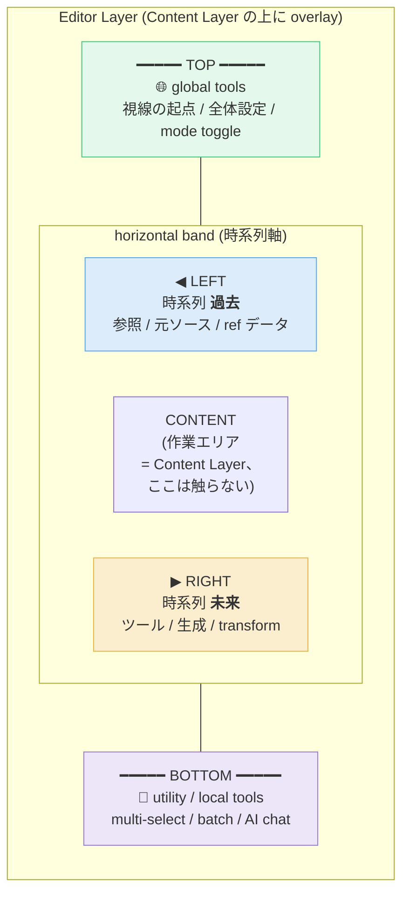
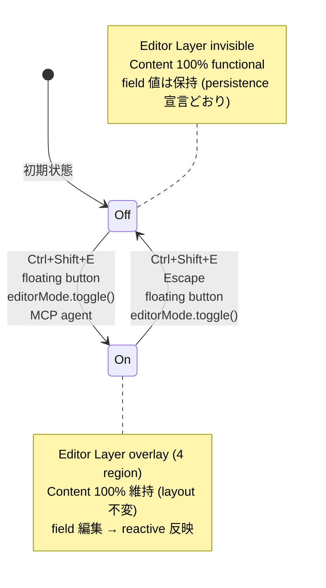

# Editor Mode — Creo UI Universal Editor Protocol

**Status**: Phase 2a **Shipped** (`packages/editor-host/` で SolidJS runtime + 4 region layout を実装済、 19 unit tests pass、 docs site で dogfood 中)
**Owners**: Creo UI (schema + Web reference runtime) + Consumer packages (Swift / Rust runtime は未着手)
**Scope**: Creo UI を「視覚的定数の SSOT」から「視覚的定数 + Editor protocol の SSOT」に拡張する設計決定。 Web は `packages/editor-host/` で reference 実装、 Swift / Rust は consumer 側 (Phase 2 後段で別 package 化検討)

---

## 1. Overview

**Editor Mode は、Creo ecosystem の任意の app において、mutable な field を「選んで live 編集」できるユニバーサルな UI 状態。**

- 特定の instance (Studio / DevEditor) ではなく、**mode** (状態) として 全 app が持つ
- Content Layer は一切触らず、**overlay** として 4 領域に展開される
- mode は**手動 toggle**、OFF 時は完全不可視、ON 時も Content の layout を変化させない
- field binding の protocol と 4 方向 semantic layout を **Creo UI が schema owner として規定**
- runtime 実装は consumer 側 (`@creo/ui` for Web, `CreoUI` for Swift, `creo-ui` for Rust) が担う

---

## 2. 設計決定 (D-1 ~ D-12)

| # | 項目 | 決定 |
|---|------|------|
| D-1 | Editor の粒度 | **Mode (universal state)** — instance 命名は使わない |
| D-2 | 4 方向 semantic layout | TOP (global) / LEFT (source・過去) / RIGHT (tool・未来) / BOTTOM (utility) |
| D-3 | 2 軸の意味 | 水平=時系列 (左→右: 過去→未来) / 垂直=階層 (上=グローバル, 下=ローカル) |
| D-4 | Field 宣言 | `id / label / type / semantic / group / bind / persistence / role / order?` |
| D-5 | Field source | **あらかじめ (framework)** + **カスタム (app-specific)** の 2 ルート |
| D-6 | 非侵襲性 | Editor Layer は Content の座標・可視性・操作を奪わない |
| D-7 | Mode toggle | 手動のみ (keyboard / floating button / programmatic API / MCP)、自動 ON なし |
| D-8 | Mode OFF の挙動 | Editor Layer 完全不可視、field 値は保持 |
| D-9 | Reactive 反映 | field 変更が bind 先 (token / state / prop) に即反映、Content が再描画 |
| D-10 | AI agent access | 同 protocol を MCP 経由で (enter/select/set/subscribe/exit) |
| D-11 | protocol owner | **Creo UI** (schema + TS 型 + JSON schema)、実装は consumer 側 |
| D-12 | 段階 | Phase 1 = 設計 memo + editor-mode tokens / Phase 2 = Web 実装・MCP / Phase 3+ = Swift 実装、theme 切替 |

---

## 3. 4 方向 Semantic Layout

### 物理配置



### 2 軸の独立意味論

| 軸 | Low end | High end | 原理 |
|----|---------|----------|------|
| **水平 (X)** | 左 = 時系列的 **過去** (source / reference / original) | 右 = 時系列的 **未来** (tool / generate / transform) | 元を見ながら未来を作る、左→右の時間流 |
| **垂直 (Y)** | 下 = **ローカル utility** | 上 = **グローバル** (視線の起点) | 目線は上から下に流れる、上=全体 |

2 軸は**独立**で、4 領域 × 各領域の group 階層で細分化する。

---

## 4. Mode State Machine



**Off → On 以外の自動遷移は禁止** (D-7)。Content 作業中に勝手にモードが切り替わらないことで、誤操作と作業阻害を防ぐ。

---

## 5. Protocol (TypeScript)

```typescript
/** 4 方向 semantic (D-2, D-3) */
export type EditorSemantic =
  | 'global'    // TOP: 全体設定・mode toggle・視線の起点
  | 'source'    // LEFT: 参照・元ソース・時系列過去
  | 'tool'      // RIGHT: 編集・生成・時系列未来
  | 'utility'   // BOTTOM: ローカル utility

/** Field の対象 role (D-10 で MCP agent が扱えるように) */
export type EditorRole = 'dev' | 'user' | 'agent'

/** 永続化戦略 (D-4) */
export type EditorPersistence =
  | 'ephemeral'       // reload で消える (デフォルト)
  | 'localStorage'    // app 内の localStorage
  | 'user-scoped'     // Creo ID 紐付き
  | 'per-project'     // project / workspace 紐付き

/** Field 定義 */
export interface EditorField<T = unknown> {
  /** unique id、例: "tokens.spacing.md", "memory.priority" */
  id: string
  /** UI 表示名 */
  label: string
  /** 値の型 */
  type: 'number' | 'color' | 'string' | 'boolean' | 'select' | 'readonly-text'
  /** どの領域に配置するか (D-2) */
  semantic: EditorSemantic
  /** 同 semantic 内での group (省略時は "default") */
  group?: string
  /** 初期値 */
  initial: T
  /** 型別の制約 */
  constraints?: {
    min?: number
    max?: number
    step?: number
    unit?: string
    options?: readonly string[]
  }
  /** 表示対象者 (D-10) */
  role?: EditorRole
  /** 永続化方法 (省略時 "ephemeral") */
  persistence?: EditorPersistence
  /** 同 region 内での並び順 hint (省略時は宣言順) */
  order?: number
}

/** Mode 全体の runtime host (実装は consumer 側が提供) */
export interface EditorHost {
  /** Framework / app が field を登録 (D-5) */
  registerFields(fields: EditorField[]): () => void  // 返り値は unregister

  /** Mode toggle (D-7) */
  enable(): void
  disable(): void
  toggle(): void
  isEnabled(): boolean

  /** Selection (Mode ON 中のみ有効) */
  getSelection(): SelectionInfo | null
  select(target: Element | string): void
  clearSelection(): void

  /** Field value read/write (D-9) */
  getValue<T>(fieldId: string): T
  setValue<T>(fieldId: string, value: T): void
  subscribe<T>(fieldId: string, cb: (value: T) => void): () => void

  /** AI agent へ公開する MCP-ready API (D-10) */
  mcp: {
    listFields(filter?: { semantic?: EditorSemantic; role?: EditorRole }): EditorField[]
    getValue: EditorHost['getValue']
    setValue: EditorHost['setValue']
  }
}

export interface SelectionInfo {
  /** 選択中の要素識別子 (DOM selector or component id) */
  targetId: string
  /** この要素に bind されている field 一覧 */
  fields: EditorField[]
}
```

---

## 6. Field source: あらかじめ / カスタム (D-5)

### あらかじめ (framework-provided)

Creo UI が標準で宣言する fields。どの app でも自動で存在:

| Field | Semantic | Region | 用途 |
|-------|----------|--------|------|
| `theme.mode` | `global` | TOP | light / dark / high-contrast |
| `theme.locale` | `global` | TOP | ja / en / ko / ... |
| `layout.density` | `global` | TOP | compact / normal / spacious |
| `token.*` (全 token) | `tool` | RIGHT | Live token 調整 |
| `history.snapshot` | `source` | LEFT | 直近の値変更 timeline |
| `utility.copy-state` | `utility` | BOTTOM | 現状を clipboard にコピー |
| `utility.ai-chat` | `utility` | BOTTOM | Claude / AI assistant inline chat |

これらは `@creo/ui` (SolidJS 版) が自動で `registerFields()` する。

### カスタム (app-specific)

各 app が自分の editable を追加:

```tsx
// creo-memories 側で
import { useEditor } from '@creo/ui'

function MemoryItemView() {
  const { registerFields } = useEditor()

  onMount(() => {
    const unregister = registerFields([
      {
        id: 'memory.priority',
        label: 'Priority',
        type: 'select',
        constraints: { options: ['low', 'normal', 'high', 'urgent'] },
        semantic: 'tool',
        group: 'memory metadata',
        initial: 'normal',
        persistence: 'per-project',
      },
      {
        id: 'memory.source-snapshot',
        label: 'Original content',
        type: 'readonly-text',
        semantic: 'source',
        group: 'history',
        initial: memory.sourceText,
      },
    ])
    onCleanup(unregister)
  })
}
```

Mode ON で該当要素を選ぶと、LEFT に "Original content"、RIGHT に "Priority" が自動配置される。

### RIGHT 領域の並び順

複数 source から同 semantic の fields が集まったときの順序:

1. **framework** (Creo UI 標準) → 最上部
2. **app** (app-specific 登録) → 次
3. **custom** (user 定義の overlay) → 最下部
4. 同レベル内は `order?` hint → 宣言順 で安定 sort

---

## 7. 非侵襲性 (D-6)

**Editor Layer は Content Layer を物理的にも論理的にも干渉しない**。これは Editor Mode の最上位原則。

### CSS 実装パターン

```css
/* Editor Layer: 常に mount、visibility で toggle */
.creo-editor-layer {
  position: fixed;
  inset: 0;
  pointer-events: none;                /* ← baseline は透過 */
  z-index: 9998;                       /* Content の上、modal 系の下 */
  visibility: hidden;
}

.creo-editor-layer[data-mode="on"] {
  visibility: visible;
}

/* 4 領域のみ操作を拾う */
.creo-editor-layer > .region-top,
.creo-editor-layer > .region-bottom,
.creo-editor-layer > .region-left,
.creo-editor-layer > .region-right {
  pointer-events: auto;
}

/* Selection outline は見るだけ、pointer 透過 */
.creo-editor-layer > .selection-outline {
  pointer-events: none;
}

/* Region 背景は半透明 — tokens/editor-mode/region.json の bg-color + bg-opacity を合成 */
.creo-editor-layer > .region-top {
  height: var(--editor-mode-region-top-height);
  background: color-mix(
    in oklch,
    var(--editor-mode-region-bg-color) calc(var(--editor-mode-region-bg-opacity) * 100%),
    transparent
  );
  border-bottom: 1px solid var(--editor-mode-region-border);
  padding: var(--editor-mode-region-padding);
}
```

### 守るべき不変条件

1. Mode toggle の **前後で Content の DOM 構造・layout が不変**
2. Content の **scroll position が保持される**
3. Content の **focus 状態が mode toggle で失われない**
4. Content の **keyboard event は mode OFF 時も 100% 届く**
5. Mode ON 中も、Content 上の button / link の click は **通常動作する** (Editor Layer が吸収しない)

---

## 8. Editor Layer 用 token (tokens/editor-mode/*.json)

Phase 1 で既に生成済み:

| Token | 説明 | 値の出所 |
|-------|------|----------|
| `editor-mode.overlay.backdrop-opacity` | 最背面の opacity (default 0, 完全透過) | 直値 `0` |
| `editor-mode.region.bg-color` | Region 背景 RGB | `{color.surface.bg-base}` alias |
| `editor-mode.region.bg-opacity` | Region 背景の alpha | 直値 `0.92` |
| `editor-mode.region.border` | Region 輪郭 | `{color.surface.border}` alias |
| `editor-mode.region.padding` | Region 内 padding | `12px` |
| `editor-mode.region.top-height` / `bottom-height` | 水平 bar の固定高さ | `44px` |
| `editor-mode.region.left-width` / `right-width` | 垂直 panel の default 幅 | `240px` / `280px` |
| `editor-mode.axis.global` | TOP accent (purple) | `{color.brand.secondary}` |
| `editor-mode.axis.utility` | BOTTOM accent (neutral) | `{color.text.tertiary}` |
| `editor-mode.axis.past` | LEFT accent (cool blue) | `{color.semantic.info}` |
| `editor-mode.axis.future` | RIGHT accent (warm mint) | `{color.brand.primary}` |
| `editor-mode.selection.outline-hover` / `-active` | Selection outline 色 (2 state) | brand alias |
| `editor-mode.selection.outline-width` / `-offset` | outline 太さと offset | `2px` / `2px` |
| `editor-mode.panel.field-label` / `field-value` / `separator` | Panel 内 text / 区切り | text alias |
| `editor-mode.panel.field-gap` / `group-gap` | Field 縦間隔 / group 間 | `8px` / `16px` |

### Opacity + color 分離方針

半透明背景を DTCG の `color` type で `#rrggbbaa` 8 桁 hex で表現すると、custom format (Swift/Rust) の既存 `hexToRgb` が 6 桁前提で silent truncation するリスクがある。そのため:

- Color は RGB (6 桁 hex or alias) として宣言
- Opacity は `number` として独立宣言
- CSS 側で `color-mix(in oklch, var(--...) calc(... * 100%), transparent)` で合成

これにより全 platform で意味論が壊れず、Swift/Rust は半透明表現を platform native で決める余地を残せる。

---

## 9. DevEditor (既存) の migration path

creo-memories/packages/creo-ui/src/components/DevEditor.tsx は現状 single instance で独自 `globalValues()` signal を持つ。Editor Mode protocol への移行は以下の段階で:

### Step 1: adapter 実装 (後方互換)
`@creo/ui` 側に `EditorHost` 実装を追加、DevEditor の既存 API (`devInit` / `devValue`) を `EditorHost.registerFields` / `getValue` に forward する shim を置く。既存 consumer (creo-web / creo-portal) は変更不要。

### Step 2: 段階的移行
DevEditor を呼び出している箇所で、順次 `useEditor()` + `registerFields()` に書き換え。4 方向 layout に自動配置される。

### Step 3: 廃止
全箇所移行後、DevEditor 本体を `@creo/ui` から削除、Editor Layer の標準 host のみに。

### 現 DevEditor の各要素 → Editor Layer 配置

| 現 要素 | Semantic | 再配置 |
|---------|----------|--------|
| タイトル + shortcut hint | `global` | TOP |
| Slider 群 | `tool` | RIGHT |
| Group header | `tool` (group attribute) | RIGHT 内で grouping |
| Copy ボタン | `utility` | BOTTOM |

---

## 10. AI agent access (D-10)

Editor Mode は同 protocol を MCP 経由で Claude (or 他の AI agent) に公開する。

### 想定 MCP tool

```
editor_mode_enter(app_id)                        → 何もなければ no-op
editor_mode_exit(app_id)
editor_mode_list_selectable()                    → current page の selectable 要素一覧
editor_mode_select(selector)                     → 特定要素を選択
editor_mode_get_fields(selection_id?)            → (optional) 選択中要素の fields、なければ全 fields
editor_mode_get_value(field_id)
editor_mode_set_value(field_id, value)
editor_mode_subscribe(field_id)                  → polling 用 handle
```

### 典型シナリオ (dogfooding)

```
User: "一覧の情報密度が詰まりすぎ、緩めて"
Claude: editor_mode_enter("creo-web")
        editor_mode_get_value("tokens.spacing.md")      → 16px
        editor_mode_set_value("tokens.spacing.md", 20)  → 全画面 re-render
User (視覚確認): "もう少し締めて"
Claude: editor_mode_set_value("tokens.spacing.md", 18)
User: "これで"
Claude: "tokens/spacing/scale.json に 18px で commit する PR を作成しますか?"
User: "yes"
Claude: (tokens リポジトリに PR を作成)
```

この loop は **Creo UI 自身の開発** (Creo ecosystem 全体の design token を磨くプロセス) でも同じ grammar で成立する。

---

## 11. Phase Roadmap

| Phase | 内容 | Status |
|-------|------|--------|
| **Phase 1** | 設計 memo (本 doc) + `tokens/editor-mode/*.json` + TS 型 d.ts (optional) | ✅ 完了 |
| **Phase 2a** | `creo-ui-editor-host` (SolidJS) で `EditorHost` runtime 実装 + 4 region layout | ✅ **Shipped** (`packages/editor-host/`、 19 tests pass、 docs site で dogfood) |
| **Phase 2b** | MCP server 実装 (editor_mode_* tools)、Claude Code 連携 | 縮小 — `claude-in-chrome` + `window.creoEditor` console REPL で代替可能 (EH-5)、 専用 server 実装は不要 |
| **Phase 2c** | DevEditor adapter → 段階的移行 | 未着手 (creo-memories lead 判断、 EH-4) |
| **Phase 3a** | Theme 切替 (light / dark / high-contrast) を Editor Mode で prototyping | 部分着手 (`ThemeEditor` / 8 theme 切替 UI 同梱) |
| **Phase 3b** | `CreoUI` (Swift) 側に `EditorHost` 実装 | 未着手 (consumer 側 or 将来別 package で) |
| **Phase 4** | `creo-ui` (Rust / ratatui) 側に最小 Editor Mode (TUI 向け) | 未着手 (要否検討) |

---

## 12. Open questions

以下は Phase 2 着手時に詰める:

1. **Selection の表現** — CSS selector / component id / DOM element reference どれを primary に?
2. **Field id の階層的 namespace** — dot notation (`memory.priority`) vs URI 風 (`editor:///memory/priority`)
3. **Persistence の per-project 解決** — SurrealDB (creo-memories) 紐付けをどう protocol 化?
4. **Region が狭い画面での挙動** — モバイルや狭い window では bottom sheet 形式に fallback?
5. **Field 型の拡張** — `vector2` (spacing の X/Y) / `gradient` / `shadow` 等の composite 型はいつ導入?
6. **Cross-app field sharing** — 複数 app で同一 field id を共有する場合の syncing 戦略?
7. **同一画面に複数 Selection** — multi-select 時の panel 表示ルール?

---

## 13. 関連

- **CLAUDE.md**: scope 定義 (tokens + Editor Mode protocol)
- **tokens/editor-mode/**: Editor Layer 自身が consume する 5 カテゴリ token
- **VP 設計 memo** (`~/repos/vantage-point/docs/design/05-pane-content-lane-smart-canvas.md`): D-1 "CreoUI delegation: schema owner = creo-memories" / D-12 "CreoUI schema 戦略 C (Co-design)" が Editor Mode の位置付けを支える上位決定
- **既存 DevEditor** (`creo-memories/packages/creo-ui/src/components/DevEditor.tsx`): Phase 2 で Editor Mode protocol へ migration

---

## 14. Status log

- 2026-04-21: Phase 1 設計 memo 初版、tokens/editor-mode/*.json 同時追加
