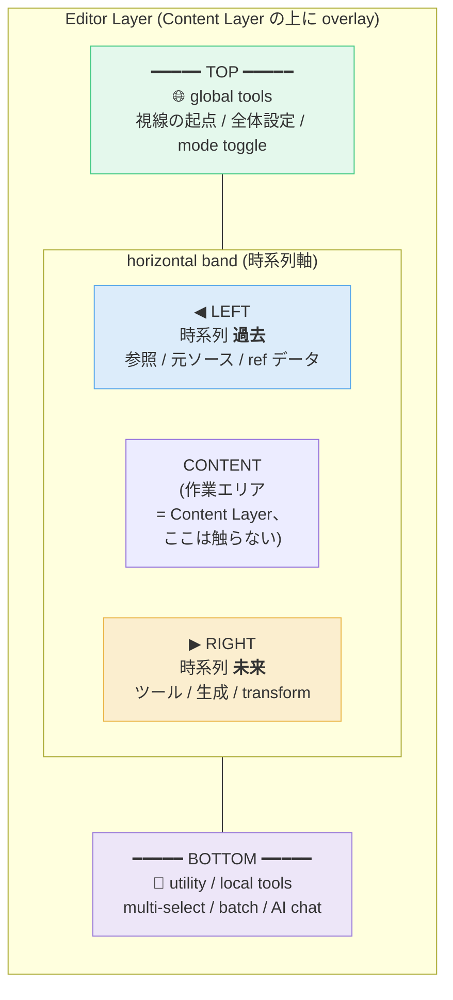
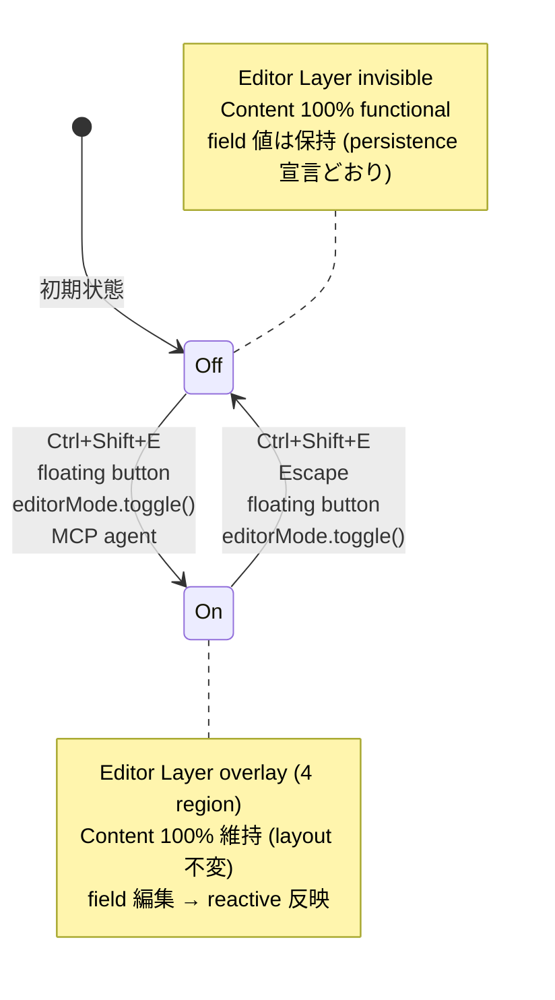

# Editor Mode — creo-ui Universal Editor Protocol

**Status**: Phase 2a **Shipped** (`packages/editor-host/` で SolidJS runtime + 4 region layout を実装済、 19 unit tests pass、 docs site で dogfood 中)
**Owners**: creo-ui (schema + Web reference runtime) + Consumer packages (Swift / Rust runtime は未着手)
**Scope**: creo-ui を「視覚的定数の SSOT」から「視覚的定数 + Editor protocol の SSOT」に拡張する設計決定。 Web は `packages/editor-host/` で reference 実装、 Swift / Rust は consumer 側 (Phase 2 後段で別 package 化検討)

---

## 1. Overview

**Editor Mode は、Creo ecosystem の任意の app において、mutable な field を「選んで live 編集」できるユニバーサルな UI 状態。**

- 特定の instance (Studio / DevEditor) ではなく、**mode** (状態) として 全 app が持つ
- Content Layer は一切触らず、**overlay** として 4 領域に展開される
- mode は**手動 toggle**、OFF 時は完全不可視、ON 時も Content の layout を変化させない
- field binding の protocol と 4 方向 semantic layout を **creo-ui が schema owner として規定**
- runtime 実装は consumer 側 (`creo-ui` for Web, `CreoUI` for Swift, `creo-ui` for Rust) が担う

---

## 2. 設計決定 (D-1 ~ D-13)

| # | 項目 | 決定 |
|---|------|------|
| D-1 | Editor の粒度 | **Mode (universal state)** — instance 命名は使わない |
| D-2 | 4 方向 semantic layout | TOP (global) / LEFT (source・過去) / RIGHT (tool・未来) / BOTTOM (utility) |
| D-3 | 2 軸の意味 | 水平=時系列 (左→右: 過去→未来) / 垂直=階層 (上=グローバル, 下=ローカル) |
| D-4 | Field 宣言 | `id / label / type / semantic / group / bind / persistence / role / order?` |
| D-5 | Field source | **あらかじめ (framework)** + **カスタム (app-specific)** の 2 ルート |
| D-6 | 非侵襲性 | Editor Layer は Content の座標・可視性・操作を奪わない |
| D-7 | Mode toggle | 手動のみ (keyboard / floating button / programmatic API / MCP)、自動 ON なし |
| D-8 | Mode OFF の挙動 | Editor Layer 完全不可視、field 値は保持 |
| D-9 | Reactive 反映 | field 変更が bind 先 (token / state / prop) に即反映、Content が再描画 |
| D-10 | AI agent access | 同 protocol を MCP 経由で (enter/select/set/subscribe/exit) |
| D-11 | protocol owner | **creo-ui** (schema + TS 型 + JSON schema)、実装は consumer 側 |
| D-12 | 段階 | Phase 1 = 設計 memo + editor-mode tokens / Phase 2 = Web 実装・MCP / Phase 3+ = Swift 実装、theme 切替 |
| D-13 | Component tweak 規約 | component CSS の `--_<component>__<knob>` + fallback (= SSOT 値) を editor が CSSOM から自動発見。`<component>` は実在する `.creo-<component>` class そのもの (id は新設しない)、`__` が境界。manifest / 手動 bind 不要 — **D-6 のデータ版非侵襲** (component は editor のために 1 行も書かない)。規約は CI (`check:tweak-vars`) が守る |

---

| **D-14** | **調整ノブの書き込みは「値ベース」で判定する** — 現在値が SSOT 既定と同じなら `removeProperty`、既定以外のときだけ inline で書く。これで「未調整なら token emit (`rem` / `calc`) のまま = browser の font 設定追従が生きる」と「調整済みなら mount 時に復元される」が **1 本の条件で両立**する。時間ベースの判定 (register 時の初回適用だけ skip する) では、localStorage からの復元の一発まで捨ててしまい永続と両立しない (2026-08-14) |
| **D-15** | **panel の開閉 state は panel 側が持つ** — accordion 個々が state を持つと、`host.fields()` の変化 (component 選択 = ノブの register) で group の DOM が作り直され、**選択のたび勝手に閉じる**。group 名を key にした表を panel が保持し、group には制御 props で渡す (2026-08-14) |

## 3. 4 方向 Semantic Layout

### 物理配置


```mermaid
flowchart TB
    subgraph FRAME["Editor Layer (Content Layer の上に overlay)"]
        direction TB
        TOP["━━━━━ TOP ━━━━━<br/>🌐 global tools<br/>視線の起点 / 全体設定 / mode toggle"]

        subgraph MID["horizontal band (時系列軸)"]
            direction LR
            L["◀ LEFT<br/>時系列 <strong>過去</strong><br/>参照 / 元ソース / ref データ"]
            C["CONTENT<br/>(作業エリア<br/>= Content Layer、<br/>ここは触らない)"]
            R["▶ RIGHT<br/>時系列 <strong>未来</strong><br/>ツール / 生成 / transform"]
        end

        BOT["━━━━━ BOTTOM ━━━━━<br/>🔧 utility / local tools<br/>multi-select / batch / AI chat"]
        TOP --- MID --- BOT
    end

    classDef global fill:#e4f8ec,stroke:#42c984
    classDef past fill:#dcecfa,stroke:#5aa8ea
    classDef future fill:#fbeecf,stroke:#eab547
    classDef utility fill:#ede6f8,stroke:#9a7ad9
    class TOP global
    class L past
    class R future
    class BOT utility
```

### 2 軸の独立意味論

| 軸 | Low end | High end | 原理 |
|----|---------|----------|------|
| **水平 (X)** | 左 = 時系列的 **過去** (source / reference / original) | 右 = 時系列的 **未来** (tool / generate / transform) | 元を見ながら未来を作る、左→右の時間流 |
| **垂直 (Y)** | 下 = **ローカル utility** | 上 = **グローバル** (視線の起点) | 目線は上から下に流れる、上=全体 |

2 軸は**独立**で、4 領域 × 各領域の group 階層で細分化する。

---

## 4. Mode State Machine


```mermaid
stateDiagram-v2
    [*] --> Off: 初期状態
    Off --> On: Ctrl+Shift+E<br/>floating button<br/>editorMode.toggle()<br/>MCP agent
    On --> Off: Ctrl+Shift+E<br/>Escape<br/>floating button<br/>editorMode.toggle()

    note left of Off
        Editor Layer invisible
        Content 100% functional
        field 値は保持 (persistence 宣言どおり)
    end note

    note right of On
        Editor Layer overlay (4 region)
        Content 100% 維持 (layout 不変)
        field 編集 → reactive 反映
    end note
```

**Off → On 以外の自動遷移は禁止** (D-7)。Content 作業中に勝手にモードが切り替わらないことで、誤操作と作業阻害を防ぐ。

---

## 5. Protocol (TypeScript)

```typescript
/** 4 方向 semantic (D-2, D-3) */
export type EditorSemantic =
  | 'global'    // TOP: 全体設定・mode toggle・視線の起点
  | 'source'    // LEFT: 参照・元ソース・時系列過去
  | 'tool'      // RIGHT: 編集・生成・時系列未来
  | 'utility'   // BOTTOM: ローカル utility

/** Field の対象 role (D-10 で MCP agent が扱えるように) */
export type EditorRole = 'dev' | 'user' | 'agent'

/** 永続化戦略 (D-4) */
export type EditorPersistence =
  | 'ephemeral'       // reload で消える (デフォルト)
  | 'localStorage'    // app 内の localStorage
  | 'user-scoped'     // Creo ID 紐付き
  | 'per-project'     // project / workspace 紐付き

/** Field 定義 */
export interface EditorField<T = unknown> {
  /** unique id、例: "tokens.spacing.m", "memory.priority" */
  id: string
  /** UI 表示名 */
  label: string
  /** 値の型 */
  type: 'number' | 'color' | 'string' | 'boolean' | 'select' | 'readonly-text'
  /** どの領域に配置するか (D-2) */
  semantic: EditorSemantic
  /** 同 semantic 内での group (省略時は "default") */
  group?: string
  /** 初期値 */
  initial: T
  /** 型別の制約 */
  constraints?: {
    min?: number
    max?: number
    step?: number
    unit?: string
    options?: readonly string[]
  }
  /** 表示対象者 (D-10) */
  role?: EditorRole
  /** 永続化方法 (省略時 "ephemeral") */
  persistence?: EditorPersistence
  /** 同 region 内での並び順 hint (省略時は宣言順) */
  order?: number
}

/** Mode 全体の runtime host (実装は consumer 側が提供) */
export interface EditorHost {
  /** Framework / app が field を登録 (D-5) */
  registerFields(fields: EditorField[]): () => void  // 返り値は unregister

  /** Mode toggle (D-7) */
  enable(): void
  disable(): void
  toggle(): void
  isEnabled(): boolean

  /** Selection (Mode ON 中のみ有効) */
  getSelection(): SelectionInfo | null
  select(target: Element | string): void
  clearSelection(): void

  /** Field value read/write (D-9) */
  getValue<T>(fieldId: string): T
  setValue<T>(fieldId: string, value: T): void
  subscribe<T>(fieldId: string, cb: (value: T) => void): () => void

  /** AI agent へ公開する MCP-ready API (D-10) */
  mcp: {
    listFields(filter?: { semantic?: EditorSemantic; role?: EditorRole }): EditorField[]
    getValue: EditorHost['getValue']
    setValue: EditorHost['setValue']
  }
}

export interface SelectionInfo {
  /** 選択中の要素識別子 (DOM selector or component id) */
  targetId: string
  /** この要素に bind されている field 一覧 */
  fields: EditorField[]
}
```

---

## 6. Field source: あらかじめ / カスタム (D-5)

### あらかじめ (framework-provided)

creo-ui が標準で宣言する fields。どの app でも自動で存在:

| Field | Semantic | Region | 用途 |
|-------|----------|--------|------|
| `theme.mode` | `global` | TOP | light / dark / high-contrast |
| `theme.locale` | `global` | TOP | ja / en / ko / ... |
| `layout.density` | `global` | TOP | compact / normal / spacious |
| `token.*` (全 token) | `tool` | RIGHT | Live token 調整 |
| `history.snapshot` | `source` | LEFT | 直近の値変更 timeline |
| `utility.copy-state` | `utility` | BOTTOM | 現状を clipboard にコピー |
| `utility.ai-chat` | `utility` | BOTTOM | Claude / AI assistant inline chat |

これらは `creo-ui` (SolidJS 版) が自動で `registerFields()` する。

### カスタム (app-specific)

各 app が自分の editable を追加:

```tsx
// creo-memories 側で
import { useEditor } from '@chronista-club/creo-ui'

function MemoryItemView() {
  const { registerFields } = useEditor()

  onMount(() => {
    const unregister = registerFields([
      {
        id: 'memory.priority',
        label: 'Priority',
        type: 'select',
        constraints: { options: ['low', 'normal', 'high', 'urgent'] },
        semantic: 'tool',
        group: 'memory metadata',
        initial: 'normal',
        persistence: 'per-project',
      },
      {
        id: 'memory.source-snapshot',
        label: 'Original content',
        type: 'readonly-text',
        semantic: 'source',
        group: 'history',
        initial: memory.sourceText,
      },
    ])
    onCleanup(unregister)
  })
}
```

Mode ON で該当要素を選ぶと、LEFT に "Original content"、RIGHT に "Priority" が自動配置される。

### CSS 規約 — private tweak var (D-13 / F2b)

第 3 の field source。component CSS の**使用箇所そのもの**が宣言になる:

```css
.creo-badge {
  padding: var(--_badge__pad-y, 2px) var(--_badge__pad-x, var(--spacing-s));
  border-radius: var(--_badge__radius, var(--radius-full));
}
```

規約は 1 個だけ — **`--_<component>__<knob>` + fallback (= SSOT 初期値)**:

- `--_` prefix は private の印 (public API ではない、theme 契約に含まれない)
- **`<component>` は実在する `.creo-<component>` class そのもの**。creo-ui の
  component には既に id がある — class がそれで、新設しない
- **`__` が component と knob の境界**。ハイフンだけだと
  `--_accordion-content-pad-x` を `accordion` と読むか `accordion-content` と
  読むかが原理的に決まらない。最長一致は「今たまたま当たっている」だけで、
  `.creo-btn-pad` のような class が増えた瞬間に解釈が静かに変わる
- **fallback を持つ使用箇所だけ**がノブになる。`--_btn__fg` のような fallback 無し
  内部 var (variant が値を流すだけ) は対象外
- editor-host が `document.styleSheets` を scan → fallback を computed 値まで
  解決 → 型推論 (number → slider / color → picker) → 自動 bind
- 書き込み先は `:root` — **component-type scope** (当該 component の全 instance
  に効く)。consumer 側: `config.discoverComponents` (F2c、default true) または
  `config.discoverTweaks: true` (F2b eager) / `creoEditor.discoverTweaks()` (REPL)

規約は **CI が守る** (`scripts/check-tweak-vars.mjs` / `bun run check:tweak-vars`)。
`__` の欠落と、対応する `.creo-*` が存在しない component 名を弾く。命名規約は
検査が無いと数ヶ月で腐るので、抽出をそれに依存させるならセットで入れる。

編集の 3-scope model (2026-07-12 の設計議論で確定):

| scope | 動く範囲 | 書き込み先 | field source |
|---|---|---|---|
| token | design system 全体 | `:root` の `--spacing-s` 等 | autoDiscover (F2) |
| component-type | 当該 component の全 instance | `:root` の `--_badge__*` | tweak var 規約 (F2b / F2c) |
| instance | 選択中の 1 要素 | signal / app state | 手動 bind |

radius.full = 9999px のような **sentinel 値 (px で 512 超) は 0-128px へ丸める**
(`sliderSpecFor`。2026-08-06 まで除外していたが、button の丸みが panel から
消えるため方針変更)。instance scope の data-attribute discovery は将来の設計課題。

panel の scope 3 分割表示 (2026-07-12 の Phase B) は **2026-08-06 に一旦撤去**した。
「選ぶ前に全部並んでいる」構造がそもそも渋滞の原因だったので、panel を白紙に戻して
Discovery から積み直す (次節)。

**tweak var は「使用箇所に fallback」で書く (pattern B) こと**。base rule 側で
`.creo-card { --_card__pad: var(--spacing-m); padding: calc(var(--_card__pad) * ...) }`
と宣言する pattern A は 2 重に成立しない — (a) fallback が無いので scan に
載らない、(b) custom property は **要素自身の宣言が継承より強い**ため
`:root` への書き込みが届かない。variant 側の `--_card__pad: var(--spacing-s)` は
そのまま宣言してよい (その variant だけ editor から外れる、badge と同じ挙動)。

### 選択駆動の component field 解決 (F2c)

F2b までは「mount 時に画面上の tweak var を全部 register する」eager 方式で、
2 つの弱点があった:

1. **panel が渋滞する** — 画面に居る component 全部のノブが一度に並ぶ
2. **値が焼き付く** — `host.register()` は登録時に初期値を `:root` へ書くので、
   register した数だけ `<html>` の inline style に解決済み値が固定される

そして何より、**選択 (`data-editor-fields`) は手で仕込まないと機能しなかった**。

F2c はこれを反転させ、**命名規約 `--_<component>__<knob>` を唯一の根拠**にする。
mount 時は **index を作るだけ** (DOM 書き込みゼロ、index 構築も初回アクセスまで遅延)、
選ばれた component のノブ **だけ** を lazy に register する。
config は `discoverComponents` (**default: true**)。

抽出は **var 名を `__` で split するだけ**で終わる:

```
--_error-boundary__pad-x  →  component: error-boundary  /  knob: pad-x
                             selector : .creo-error-boundary
```

CSSOM から読むのは fallback だけで、**`selectorText` は見ない**。これで
`@media` / `:is()` / state 疑似 / cross-origin stylesheet といった selector 解析の
落とし穴が最初から存在しない (実際、selector 逆引きで実装した初版では
`focus` が `focus-visible` を食う・comma list の subject 取り違え・fallback の
解決先違い、と 3 種のバグを踏んだ)。

component ↔ class が 1:1 なので DOM 側も軽い:

- **要素 → ノブ** は `el.classList` を index に引くだけ。`el.matches()` は不要
- **component → 画面に居るか** は `document.querySelector('.creo-<id>')` 1 回
- **panel に component 一覧を出せる** — index の keys がそのまま候補になる

実装上の要点 (`component-id.ts` / `component-fields.ts`):

- **fallback は対象要素の computed style で解決する** — `--_btn__pad-y` の fallback
  `var(--_btn__size-pad-y)` は `.creo-btn` 上にしか無く、`:root` では解決できない。
  ここを `:root` でやると btn のノブが丸ごと消える
- **sentinel は捨てずに丸める** — `var(--radius-full)` = 9999px を除外すると
  button の丸みという最も触りたいノブが消える。0–128px へ丸める (CSS は radius を
  短辺の半分に clamp するので pill 用途では見た目不変)
- **register は選択時のみ** — 一覧の列挙や hover は副作用なし

選択対象は「明示 bind (`data-editor-fields`) > class 由来のノブ > creo-ui component
ではあるがノブ無し」の優先順で祖先方向へ辿る。最後の fallback があるので、
ノブ未整備の component でも「何を選んだか」は panel に出る。

### Panel の作り直し — Discovery から積む (2026-08-06〜)

規約ベースになったことで **panel に component 一覧を出せる**ようになった。
これを受けて panel を白紙に戻し、段階的に組み直している。

旧 panel は「Mode を ON にした瞬間に、触れるもの全部が並んでいる」構造だった。
scope で 3 分割しても、選ぶ前から候補が全部見えている点は変わらず、渋滞の
根本原因はそこにあった。**選んでから出す**へ反転する。

Discovery の形は 2026-08-09 の設計議論で確定 — **DOM ツリー (Outliner 的) ×
drill-in**。panel は 2 view を selection state で切り替える:

- **tree view** (選択なし): ページの実 DOM から作った creo component の
  instance ツリー (`component-tree.ts` / `resolver.tree()`)。非 creo 要素は
  素通しして子を引き上げ、同 component の sibling は `×N` に畳む
  (Outliner の row 等で行が爆発するため。代表 = 最初の instance)。
  sub-part の親子関係は DOM の入れ子として自然に出る
- **detail view** (選択あり): ← 戻る + component 名 + ノブ (FieldEditor)。
  300px の panel 幅を全部ノブに使う

**ツリーはナビゲーション、編集は component scope のまま** (D-13)。選んだ
instance は outline の対象と fallback 解決の基準要素として使うだけで、
書き込み先は `:root` (全 instance に効く)。ページ上の要素クリックも同じ
selection state に載るので、どちらの入口からでも detail view に着地する。

選択の意味論は 2026-08-09 の設計議論で確定した。北極星は **「開発中に気に
なった箇所を、その場で即調整できる」** — 気づく → 指す → 回す、の摩擦最小化:

- **選択の実体は class** (`--_<component>__` の component = `.creo-<component>`)。
  instance はアンカーで、「どの個体を基準に fallback を読んだか」「outline と
  scroll の行き先」にだけ使う
- **outline はハイブリッド** — アンカー instance は強い枠、同 class の他 instance
  は淡い破線 (上限 80)。編集は component scope (全 instance に効く) なので、
  囲い方が効果範囲とズレると「囲っていないものが変わった」驚きが起きる。
  それを構造的に防ぐ
- **入れ子は最内 + 祖先への梯子** — クリックは指したもの (最内の creo component)
  を選び、detail header の breadcrumb (`↑ card-header ↑ card`) で親へ 1 click で
  上がれる
- **hover は双方向** — tree の行 hover でページ上の該当 instance に outline、
  ページ hover で outline + class 名ラベル。Discovery の「この行は画面のどれ？」
  「クリックしたら何が選ばれる？」を両側から解く
- **Esc は 2 段** — 選択中は解除 (detail → tree)、未選択なら Mode OFF

編集の射程は **ノブ + 脱出ハッチ** の 2 経路 (脱出ハッチは 2026-08-14 実装):
宣言済み tweak var のノブが「良い経路」(型付き slider / SSOT fallback / density
連動を保つ)。加えて detail の「他の property…」(`class-overrides.ts` +
`OtherPropsSection`) が class の base rule の実 CSS 宣言を CSSOM から一覧し、
任意の property を注入 stylesheet の `.creo-<component>` override rule で
上書きできる。base rule に無い property も `property: value` 形式で追加可能。
class 単位 = component scope の原則と一貫し、export は「CSS をコピー」で
rule block を取り出して component CSS への変更提案にする。

制約 (意図的):
- `calc(var × density)` の**式ごと上書き**になるため、構造を保った編集は
  あくまでノブ側 — 「まずノブ、無ければハッチ」の順
- 注入 rule は base rule と同 specificity の後勝ち。variant rule
  (`[data-variant]` 等) が同じ property を張る場合はそちらが勝つ — base rule を
  直接編集したのと同じ、正直な cascade
- persistence は無し (梯子ノブと同じ調整セッション用)。provider が畳まれると
  注入 stylesheet ごと破棄される

旧 panel の 3-scope field 一覧 / ThemeEditor / ExportBar は **外してある**
(`theme-editor.tsx` / `export-bar.tsx` はファイルとして残置し export もしているが、
`layer.tsx` からは描画しない)。

#### panel の情報構造 (2026-08-14 確定)

Mode を ON にした直後の初期表示は **アコーディオンの見出しだけ**:

```
● Editor Mode ON              ⠿
Esc 終了 · Ctrl+Shift+E で切替
─────────────────────────────
▸ DISCOVERY                12     ← ツリー件数を畳んだまま出す
▸ GLOBAL
▸ SURFACE
```

- **Discovery が最上段。** 「選んでから出す」の入口なので先頭に置く。畳んだ状態でも
  件数 badge でページ内の component 数が分かる
- **一層目は既定で全閉じ。** 開くたびコンパクトな状態から始まる。**開閉は永続しない** —
  「前回の状態」を復元すると、開き直したときに何が開いているか予測できないため
- **開閉 state は panel が持つ** (D-15)。component を選んでもドリルインしても閉じない
- component を選ぶと Discovery の位置が **detail view** に替わる (← 戻る + component 名 +
  ノブ + 「他の property…」)。detail のノブは畳まない — 選択は意図の表明なので即座に出す

#### global knobs (Global group)

`provider.tsx` が framework 標準として register する。**すべて `localStorage` 永続 + ↺ reset**
付きで、値ベース apply (D-14) に乗る。

| id | 内容 | 範囲 |
|---|---|---|
| `typography.scale` | 文字だけの全体伸縮。token emit の `calc(<rem> * var(--typography-scale, 1))` に効く | 0.8–1.2 / step 0.01 |
| `typography.size.{xs..xl}` | size 梯子 5 段。SSOT 値を initial に持つ | 8–32px |
| `color.brand.{hue,chroma}` | brand 系 8 var を OKLCH のまま一括で回す | hue 0–360° / chroma ×0–2 |
| `color.surface.{hue,chroma}` | surface 系 8 var を同上 | hue 0–360° / chroma ×0–3 |
| `layout.gap.sibling` | stacked 要素間の既定 gap | 0–48px |

**radius 梯子ノブは撤去した** (2026-08-14)。v0.29.0 で実測値を SSOT へ焼き込んで役目を終えたため。
必要になれば同じ形で戻せる。

#### 色ノブの設計 — 族を相対で回す / token を絶対で編む

色は **2 段構え**にしてある。

**族ノブ (Global)**: `--color-brand-*` 8 本 / `--color-surface-*` 8 本を 1 組として扱い、
**hue は基準 var との差分**、**chroma は倍率**で全 var に適用する (`brand-color.ts` の
`createOklchColorControl(vars, baseVar)`)。

- 差分適用なので、contrast theme のように族内で複数 hue を持つ family でも**相対関係が保たれる**
- **`l` (明度) は触らない** — light/dark のコントラスト設計を壊さないため
- 中立 (差分 0 かつ倍率 1) に戻ると `removeProperty` して **theme 切替への追従が復活**する
- 基準色は「初めて中立を離れた瞬間」に capture する。上書き済みの inline 値を読み直すと
  差分が二重に掛かるため

**個別 token (Surface group)**: surface 系 8 var を L/C/H/A slider で**絶対値編集**する。
族ノブが相対調整なのに対し、こちらは 1 本ずつ直接いじる用。

#### ノブ UI の作法

- **number は 1 ライナー** — `name (ellipsis) | slider | 値 | ↺`。slider は **flex-basis 50% 固定**で、
  どの行もトラックの左右端が縦に揃う (複数ノブの相対位置を比べられる)。name は残り幅で
  ellipsis し、全文は `title` に出す
- **↺ reset は number / color 共通部品** (`ResetButton`)。**既定値と異なるときだけ表示**され、
  既定のままは `visibility: hidden` で列幅を保つ。「↺ が見えている = 既定から動かしてある」の
  サインも兼ねる
- **自動発見ノブの step は unit-aware** — `rem`/`em` の 1–10 帯は 0.1 刻み。px と同じ 0.5 だと
  0.5rem = 8px 飛びになり slider として使えない (`auto-discover.ts` の `heuristicRange`)

**トレードオフ**: 規約ベースは variant 固有ノブ (`.creo-btn--sm` を選んだときだけ
出るノブ) を表現できない。selector 逆引きなら可能だったが、現状 variant 側は
fallback 無しの宣言しか持たない = ノブではないので実害は無い。必要になったら
knob 名側に variant を持たせる (`--_btn__sm-pad-x`) 拡張で足りる。

### RIGHT 領域の並び順

複数 source から同 semantic の fields が集まったときの順序:

1. **framework** (creo-ui 標準) → 最上部
2. **app** (app-specific 登録) → 次
3. **custom** (user 定義の overlay) → 最下部
4. 同レベル内は `order?` hint → 宣言順 で安定 sort

---

## 7. 非侵襲性 (D-6)

**Editor Layer は Content Layer を物理的にも論理的にも干渉しない**。これは Editor Mode の最上位原則。

### CSS 実装パターン

```css
/* Editor Layer: 常に mount、visibility で toggle */
.creo-editor-layer {
  position: fixed;
  inset: 0;
  pointer-events: none;                /* ← baseline は透過 */
  z-index: 9998;                       /* Content の上、modal 系の下 */
  visibility: hidden;
}

.creo-editor-layer[data-mode="on"] {
  visibility: visible;
}

/* 4 領域のみ操作を拾う */
.creo-editor-layer > .region-top,
.creo-editor-layer > .region-bottom,
.creo-editor-layer > .region-left,
.creo-editor-layer > .region-right {
  pointer-events: auto;
}

/* Selection outline は見るだけ、pointer 透過 */
.creo-editor-layer > .selection-outline {
  pointer-events: none;
}

/* Region 背景は半透明 — tokens/editor-mode/region.json の bg-color + bg-opacity を合成 */
.creo-editor-layer > .region-top {
  height: var(--editor-mode-region-top-height);
  background: color-mix(
    in oklch,
    var(--editor-mode-region-bg-color) calc(var(--editor-mode-region-bg-opacity) * 100%),
    transparent
  );
  border-bottom: 1px solid var(--editor-mode-region-border);
  padding: var(--editor-mode-region-padding);
}
```

### 守るべき不変条件

1. Mode toggle の **前後で Content の DOM 構造・layout が不変**
2. Content の **scroll position が保持される**
3. Content の **focus 状態が mode toggle で失われない**
4. Content の **keyboard event は mode OFF 時も 100% 届く**
5. Mode ON 中も、Content 上の button / link の click は **通常動作する** (Editor Layer が吸収しない)

---

## 8. Editor Layer 用 token (tokens/editor-mode/*.json)

Phase 1 で既に生成済み:

| Token | 説明 | 値の出所 |
|-------|------|----------|
| `editor-mode.overlay.backdrop-opacity` | 最背面の opacity (default 0, 完全透過) | 直値 `0` |
| `editor-mode.region.bg-color` | Region 背景 RGB | `{color.surface.bg-base}` alias |
| `editor-mode.region.bg-opacity` | Region 背景の alpha | 直値 `0.92` |
| `editor-mode.region.border` | Region 輪郭 | `{color.surface.border}` alias |
| `editor-mode.region.padding` | Region 内 padding | `12px` |
| `editor-mode.region.top-height` / `bottom-height` | 水平 bar の固定高さ | `44px` |
| `editor-mode.region.left-width` / `right-width` | 垂直 panel の default 幅 | `240px` / `280px` |
| `editor-mode.axis.global` | TOP accent (purple) | `{color.brand.secondary}` |
| `editor-mode.axis.utility` | BOTTOM accent (neutral) | `{color.text.tertiary}` |
| `editor-mode.axis.past` | LEFT accent (cool blue) | `{color.semantic.info}` |
| `editor-mode.axis.future` | RIGHT accent (warm mint) | `{color.brand.primary}` |
| `editor-mode.selection.outline-hover` / `-active` | Selection outline 色 (2 state) | brand alias |
| `editor-mode.selection.outline-width` / `-offset` | outline 太さと offset | `2px` / `2px` |
| `editor-mode.panel.field-label` / `field-value` / `separator` | Panel 内 text / 区切り | text alias |
| `editor-mode.panel.field-gap` / `group-gap` | Field 縦間隔 / group 間 | `8px` / `16px` |

### Opacity + color 分離方針

半透明背景を DTCG の `color` type で `#rrggbbaa` 8 桁 hex で表現すると、custom format (Swift/Rust) の既存 `hexToRgb` が 6 桁前提で silent truncation するリスクがある。そのため:

- Color は RGB (6 桁 hex or alias) として宣言
- Opacity は `number` として独立宣言
- CSS 側で `color-mix(in oklch, var(--...) calc(... * 100%), transparent)` で合成

これにより全 platform で意味論が壊れず、Swift/Rust は半透明表現を platform native で決める余地を残せる。

---

## 9. DevEditor (既存) の migration path

> **Status (2026-08-30)**: **creo-ui 側からは着手しない。** CLAUDE.md / EH-4 の通り
> `creo-memories/packages/creoui` の DevEditor は直接触らず、migration の是非と時期は
> **creo-memories lead の判断**。以下は移行することになった場合の想定手順であり、
> creo-ui 側の予定ではない。

creo-memories/packages/creoui/src/components/DevEditor.tsx は現状 single instance で独自 `globalValues()` signal を持つ。Editor Mode protocol への移行は以下の段階で:

### Step 1: adapter 実装 (後方互換)
`creo-ui` 側に `EditorHost` 実装を追加、DevEditor の既存 API (`devInit` / `devValue`) を `EditorHost.registerFields` / `getValue` に forward する shim を置く。既存 consumer (creo-web / creo-portal) は変更不要。

### Step 2: 段階的移行
DevEditor を呼び出している箇所で、順次 `useEditor()` + `registerFields()` に書き換え。4 方向 layout に自動配置される。

### Step 3: 廃止
全箇所移行後、DevEditor 本体を `creo-ui` から削除、Editor Layer の標準 host のみに。

### 現 DevEditor の各要素 → Editor Layer 配置

| 現 要素 | Semantic | 再配置 |
|---------|----------|--------|
| タイトル + shortcut hint | `global` | TOP |
| Slider 群 | `tool` | RIGHT |
| Group header | `tool` (group attribute) | RIGHT 内で grouping |
| Copy ボタン | `utility` | BOTTOM |

---

## 10. AI agent access (D-10)

Editor Mode は同 protocol を MCP 経由で Claude (or 他の AI agent) に公開する。

### 想定 MCP tool

```
editor_mode_enter(app_id)                        → 何もなければ no-op
editor_mode_exit(app_id)
editor_mode_list_selectable()                    → current page の selectable 要素一覧
editor_mode_select(selector)                     → 特定要素を選択
editor_mode_get_fields(selection_id?)            → (optional) 選択中要素の fields、なければ全 fields
editor_mode_get_value(field_id)
editor_mode_set_value(field_id, value)
editor_mode_subscribe(field_id)                  → polling 用 handle
```

### 典型シナリオ (dogfooding)

```
User: "一覧の情報密度が詰まりすぎ、緩めて"
Claude: editor_mode_enter("creo-web")
        editor_mode_get_value("tokens.spacing.m")      → 16px
        editor_mode_set_value("tokens.spacing.m", 20)  → 全画面 re-render
User (視覚確認): "もう少し締めて"
Claude: editor_mode_set_value("tokens.spacing.m", 18)
User: "これで"
Claude: "tokens/spacing/scale.json に 18px で commit する PR を作成しますか?"
User: "yes"
Claude: (tokens リポジトリに PR を作成)
```

この loop は **creo-ui 自身の開発** (Creo ecosystem 全体の design token を磨くプロセス) でも同じ grammar で成立する。

---

## 11. Phase Roadmap

| Phase | 内容 | Status |
|-------|------|--------|
| **Phase 1** | 設計 memo (本 doc) + `tokens/editor-mode/*.json` + TS 型 d.ts (optional) | ✅ 完了 |
| **Phase 2a** | `@chronista-club/creo-ui-editor-host` (SolidJS) で `EditorHost` runtime 実装 + 4 region layout | ✅ **Shipped** (`packages/editor-host/` v0.8.1、 167 tests pass、 docs site 全ページで dogfood) |
| **Phase 2b** | MCP server 実装 (editor_mode_* tools)、Claude Code 連携 | 縮小 — `claude-in-chrome` + `window.creoEditor` console REPL で代替可能 (EH-5)、 専用 server 実装は不要 |
| **Phase 2c** | DevEditor adapter → 段階的移行 | 未着手 (creo-memories lead 判断、 EH-4) |
| **Phase 3a** | Theme 切替 (light / dark / high-contrast) を Editor Mode で prototyping | 方針変更 — `ThemeEditor` は panel から外した (export は残置)。theme の調整は **Global の色ノブ + Surface group** で行う (§6 参照、2026-08-14) |
| **Phase 3b** | `CreoUI` (Swift) 側に `EditorHost` 実装 | 未着手 (consumer 側 or 将来別 package で) |
| **Phase 4** | `creo-ui` (Rust / ratatui) 側に最小 Editor Mode (TUI 向け) | 未着手 (要否検討) |

---

## 12. Open questions

以下は Phase 2 着手時に詰める:

1. ~~**Selection の表現** — CSS selector / component id / DOM element reference どれを primary に?~~
   → 2026-08-04 の F2c で決着。primary は **DOM element** (hover/click で確定) とし、
   そこから CSS selector を逆引きして field を解決、表示名だけ component id
   (`.creo-btn`) を使う。3 つのうち 1 つを選ぶのではなく役割で分けた。
2. **Field id の階層的 namespace** — dot notation (`memory.priority`) vs URI 風 (`editor:///memory/priority`)
3. **Persistence の per-project 解決** — SurrealDB (creo-memories) 紐付けをどう protocol 化?
4. **Region が狭い画面での挙動** — モバイルや狭い window では bottom sheet 形式に fallback?
5. **Field 型の拡張** — `vector2` (spacing の X/Y) / `gradient` / `shadow` 等の composite 型はいつ導入?
   → `color` は 2026-08-14 に OKLCH editor (L/C/H/A slider + ↺) として実装済み (§6)。
   残る composite 型は未着手
6. **Cross-app field sharing** — 複数 app で同一 field id を共有する場合の syncing 戦略?
7. **同一画面に複数 Selection** — multi-select 時の panel 表示ルール?

---

## 13. 関連

- **CLAUDE.md**: scope 定義 (tokens + Editor Mode protocol)
- **tokens/editor-mode/**: Editor Layer 自身が consume する 5 カテゴリ token
- **VP 設計 memo** (`~/repos/vantage-point/docs/design/05-pane-content-lane-smart-canvas.md`): D-1 "CreoUI delegation: schema owner = creo-memories" / D-12 "CreoUI schema 戦略 C (Co-design)" が Editor Mode の位置付けを支える上位決定
- **既存 DevEditor** (`creo-memories/packages/creoui/src/components/DevEditor.tsx`): Phase 2 で Editor Mode protocol へ migration

---

## 14. Status log

- 2026-04-21: Phase 1 設計 memo 初版、tokens/editor-mode/*.json 同時追加
- 2026-07-12: D-13 (private tweak var 規約) 追加 — F2b (CSSOM auto-discover +
  DOM presence filter) を editor-host に実装、badge.css で dogfood。3-scope
  model (token / component-type / instance) を確定。bind() に host 明示注入を
  追加 (onMount owner に context が無く F2/F2b が throw する問題の fix)
- 2026-07-12: Phase B — RIGHT panel の 3-scope 分割表示を実装 (EditorField.scope
  + ScopeSection)。console REPL の dev 自動 expose を localhost 判定に変更
  (library build で `import.meta.env.DEV` が false に固定化される問題の fix)。
  sentinel 値 (px 512 超) を slider ノブから除外
- 2026-07-13: OKLCH color editor (Phase M6 第一弾) — color field の値が oklch
  literal のとき L/C/H/A の 4 slider editor に切替 (`src/oklch.ts` +
  `OklchEditor`)。track は CSS `oklch()` グラデーション (色空間変換の数学
  不要、browser が解釈)、書き戻しも oklch literal で token の SSOT 形式を
  保つ。hex 等 oklch でない値は従来の native color picker に fallback。
  ThemeEditor の swatch クリック起動は未実装 (M6 残り)
- 2026-07-13: Editor Layer を **ミニマム版に刷新** — 旧 4-region 全画面 overlay を
  廃し、右上の floating inspector パネル1枚に集約 (page は全面ブライト、対象を
  見ながら param を回すことに集中)。theme swatch / export bar は既定から外し
  CollapsibleSection で panel 内に畳み戻し (theme-editor.tsx / export-bar.tsx は
  残置)。`<Portal>` で document.body 直下に mount し、consumer の `.docs-main` の
  `perspective` が作る containing block から脱出 (position:fixed を viewport 基準に
  戻す + outline 座標ズレ解消、transform/filter/perspective を使う consumer でも
  壊れない堅牢性改善)。パネルは **ヘッダ掴みで drag 移動** + 位置を localStorage
  永続化 (`{namespace}:layer:panel-pos`、EditorHost.namespace を新規 expose)。
  被り回避 `--editor-mode-dock-top` / 幅 `--editor-mode-dock-width` を導入。
  team-b review で drag listener leak / 画面外クランプ不発を修正
- 2026-08-04: **F2c 選択駆動の component field 解決** — `data-editor-fields` の
  事前仕込み無しに creo-ui component をクリックするだけでノブが出るようにした
  (`selector-utils.ts` + `component-fields.ts`、config `discoverComponents`
  default true)。CSSOM の selectorText を `el.matches()` で逆引きするので
  命名規約に依存せず、`--_eb-*` ↔ `.creo-error-boundary` の略記ズレも吸収する。
  panel の group / section title も selector 由来の component 名に。あわせて
  web の全 component CSS に tweak var を整備 (**48 component / 93 knob**、
  従来は 14 file のみ)。`card` / `stack` / `grid` / `table` は base rule 側で
  `--_x: ...` を宣言する pattern A だったため `:root` override が届いておらず、
  使用箇所 fallback (pattern B) へ移行 (見た目は不変)
- 2026-08-06: **F2c を命名規約ベースへ転換** — selector 逆引き
  (`selector-utils.ts`) を廃し、tweak var の命名規約
  **`--_<component>__<knob>`** を唯一の根拠にした (`component-id.ts`)。
  creo-ui の component には既に id がある — class `.creo-<id>` がそれで、
  `<component>` はそれと一致することを CI (`check:tweak-vars`) が保証する。
  抽出は `__` の split 1 回で終わり、CSSOM から読むのは fallback だけになった
  (`selectorText` を見ないので `@media` / `:is()` / state 疑似 / cross-origin
  stylesheet の解析が不要)。逆引き実装で踏んだ 3 バグ (`focus` が
  `focus-visible` を食う / comma list の subject 取り違え / fallback の解決先が
  `:root` 固定) は、いずれも構造的に発生しなくなった。
  あわせて `empty-state` / `error-boundary` / `header` / `tabs-tab` /
  `pagination-item` / `segmented-option` / `select-input` の pattern A 残りを
  pattern B へ移行し、略記 (`es` / `eb` / `hdr` / `pgn` / `seg-opt`) を class 名に
  統一 (**55 component / 111 knob**)。sentinel (radius.full = 9999px) は除外を
  やめ 0-128px へ丸める方針に変更 — 除外したままだと button の丸みという最も
  触りたいノブが panel から消えるため

### 2026-08-14 — panel の完成形 / 色ノブ / 永続化 (#135〜#157、editor-host 0.8.0〜0.8.1)

Discovery から積み直していた panel が一区切りついた。**Discovery 最上段 + 一層目全閉じの
アコーディオン**という情報構造が確定し (D-15)、Global に **色ノブ (brand / surface の hue・chroma)**
と `layout.gap.sibling` が加わった。**radius 梯子は撤去** — v0.29.0 の焼き込みで役目を終えたため。

大きいのは **調整ノブの localStorage 永続化**で、これに伴い書き込み判定を時間ベース
(register の初回だけ skip) から**値ベース**へ変えた (D-14)。時間ベースのままでは復元の一発を
捨ててしまい永続と両立しなかった。あわせて **↺ reset** を number / color 共通部品として入れ、
「既定へ戻す」が UI から常に可能になった。

`.creo-sidenav` を component 化 (#142) し、site の `selectionRoot` を body 全体へ広げた (#139)
ことで、header / sidebar も Editor の対象になった。

### 2026-08-30 — Living Documentation 回収

本 doc が **#134 (脱出ハッチ) で停止**しており、上記 22 commit 分が未反映だった。
editor-host が 7,300 行に育つ一方、その最新の姿を説明する文書が存在しない状態だったため回収した。
あわせて stale を修正 — Phase 2a の test 数 (19 → 167)、Phase 3a の ThemeEditor 記述
(panel からは外れている)、§9 DevEditor migration の主語 (creo-ui の予定ではなく
creo-memories lead 判断 = EH-4)。

**教訓**: 個々の依頼は「slider を 50% に」のような小タスクでも、**積み上がった差分は中規模を
超える**。粒度は 1 回の作業量ではなく累積で測る必要がある。

