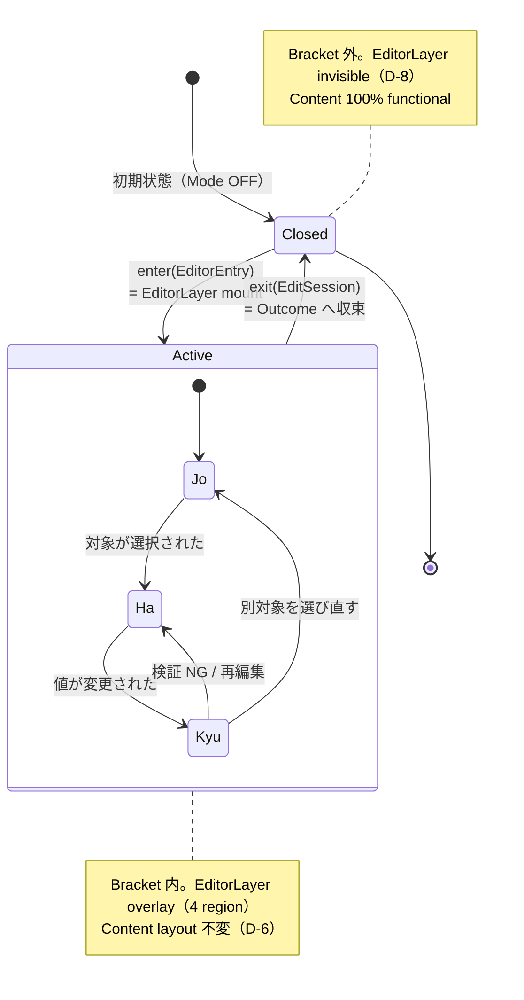
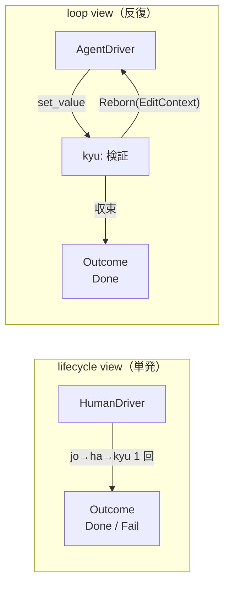
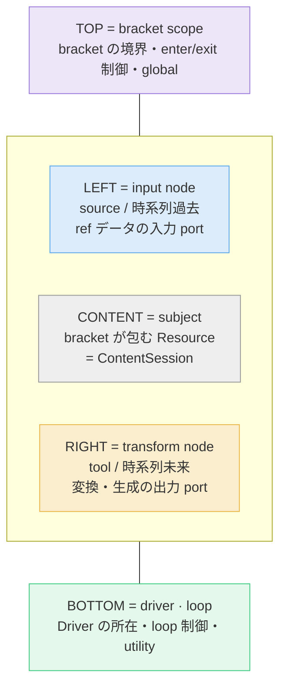
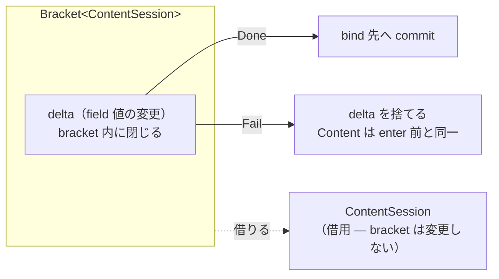
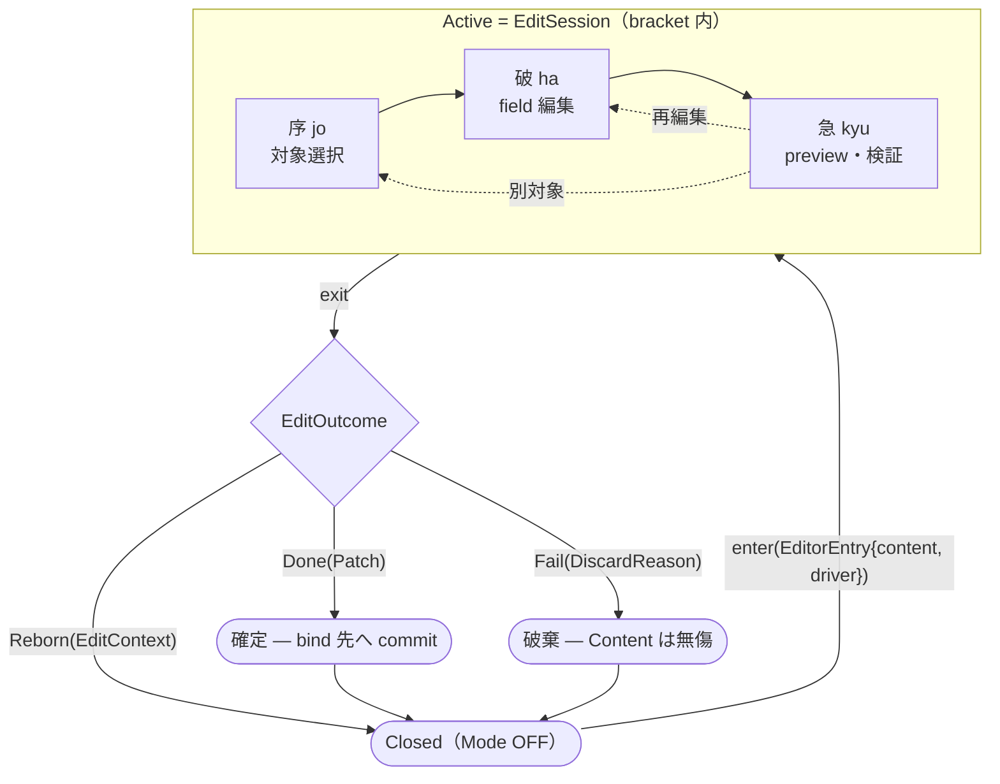

# Lifecycle Spine — Editor Mode を nostos Bracket で読み替える

**Status**: 設計ドキュメント（reframe）。実装変更は伴わない — 既存 [editor-mode.md](./editor-mode.md) の protocol を **別の語彙で記述し直した翻訳辞書**
**Owners**: creoui（Editor Mode protocol の schema owner）
**Scope**: creoui の Editor Mode protocol を `nostos` の `Bracket` / `Outcome` / `Driver` 抽象で読み替える。読み替えによって見えた構造的欠落・改善点を nostos ADR-0002 / 0003 への feedback として articulate する
**derived_from**: creo-memories `mem_1Cb7aBbzK6xJ8A2Tn5Sane`（Creo Lifecycle Spine）+ club-nostos `docs/adr/0001-bracket-and-outcome.md`
**関連 handoff**: creo-memories `mem_1Cb7aCKjHmWhusyejBf2Vt`（[INBOUND] creoui → nostos）— 本 doc 完成後にこの handoff memo が update される

---

## 0. このドキュメントの位置づけ

[editor-mode.md](./editor-mode.md) は Editor Mode protocol の **SSOT** である。D-1〜D-12 の設計決定、4 方向 semantic layout、`EditorHost` protocol、非侵襲性 D-6 はすべてそこで規定される。

本ドキュメントは editor-mode.md を **書き換えない**。Editor Mode protocol を `nostos` の lifecycle 語彙（`Bracket` / `Outcome` / `Driver`）で**読み替え**、その読み替えが creoui 設計に対して持つ含意を記述する。

> **spine memo の主張**（`mem_1Cb7aBbzK6xJ8A2Tn5Sane`）:
> nostos の Bracket + Outcome は新概念の発明ではなく、Creo ecosystem が運用で先取りしていた shape の「命名」である。
> creo-memories の status `done` / `cancelled` / `reborn` は既に `Done` / `Fail` / `Reborn` の ADT であり、stage `序破急` は Bracket の Active 相進行である。
>
> 本 doc は spine memo の product 別表にある **1 行 — 「creoui Editor Mode = `Bracket<ContentSession>`」— を 1 本のドキュメントに展開したもの**である。

### design-for ≠ depend-on（最重要の制約）

nostos は ADR が `proposed` ステータス、実装 0 行の段階にある。本 doc は **nostos を設計規律として参照する（design-for）が、creoui を nostos crate に依存させない（depend-on しない）**。

| | design-for（本 doc が行うこと） | depend-on（本 doc が行わないこと） |
|---|---|---|
| 語彙 | `Bracket` / `Outcome` / `Driver` を**説明の語彙**として借りる | — |
| コード | — | `Cargo.toml` / `package.json` に nostos を追加 |
| 型 | 既存 `EditorHost` TS 型は**そのまま**、本 doc はそこへの投影を示すのみ | nostos が export する trait を import |
| 検証 | 読み替えで構造的欠落が見えたら nostos ADR へ feedback（§9） | nostos の API が固まるまで creoui を待たせる |

editor-host は **SolidJS 一本**（EH-2）。本 doc は editor-host を他 framework 対応で抽象化する設計を**含まない**。Rust 風 pseudo-code は nostos ADR との語彙整合のための**記法**であり、creoui の実装言語の指定ではない。

---

## 1. 核心モデル — Editor Mode = `Bracket<ContentSession>`

Editor Mode は、Content をラップする **bracket** である。

```text
// nostos 語彙での pseudo-code（記法であって creoui の実装言語ではない）
Bracket<ContentSession> {
    Input   = EditorEntry      // enter に渡る — どの Content を、どの Driver で包むか
    Active  = EditSession      // jo → ha → kyu の 3 相を持つ編集 session
    Outcome = EditOutcome      // Done(Patch) | Reborn(EditContext) | Fail(DiscardReason)

    enter(EditorEntry)  -> EditSession    // = EditorLayer mount（D-7 手動 toggle ON）
    exit(EditSession)   -> EditOutcome    // = Editor Mode 終了、Outcome へ収束
}
```

`Bracket` が包む `Resource` は **`ContentSession`** ── Content Layer そのものではなく、「いま編集対象になっている Content の作業 session」という抽象である。Bracket は Content を**包む**のであって、**所有・変更・移動しない**。これが §6 で述べる「非侵襲性 = bracket の RAII 純粋性」の核心。

### 既存 protocol との対応

| nostos 語彙 | Editor Mode protocol（editor-mode.md） | 対応する決定 |
|---|---|---|
| `enter` | EditorLayer mount → Mode ON | D-7（手動 toggle）/ D-8（OFF 時 invisible） |
| `Active = EditSession` | Mode ON 中の編集状態 + Selection | §4 Mode State Machine の `On` |
| `exit` | Mode OFF / Escape / commit | D-7 |
| `Outcome` | 編集が何を残したか（commit / 継続 / 破棄） | （既存 doc に明示の概念なし — §3・§9 参照） |
| `Driver` | field を操作する主体（human / AI agent） | D-10（AI agent access）の一般化 |
| `Resource = ContentSession` | Content Layer（触らない作業エリア） | D-6（非侵襲性） |

> **読み替えで見えたこと（その 1）**: 既存 editor-mode.md には `enter` / `Active` / `exit` に相当する概念は State Machine として存在するが、**`Outcome`（編集が終わったとき何が残るか）を明示する概念がない**。Mode を OFF にすると field 値は保持される（D-8）が、それが「commit された Patch」なのか「未確定の継続状態」なのか「破棄」なのかを protocol が区別していない。§3 がこの欠落を埋める。

---

## 2. enter / Active / exit ── bracket lifecycle



### `enter` — bracket を開く

`enter` は `EditorEntry` を受け取り `EditSession` を返す。具体的には EditorLayer の mount（Mode ON）。

```text
EditorEntry {
    content: ContentSession   // 包む対象
    driver:  Driver           // 誰が編集するか（§5）— first-class
}
```

D-7「Mode toggle は手動のみ・自動 ON なし」は、bracket 語彙では **「`enter` は明示的に呼ばれる ── 環境が勝手に bracket を開かない」** と読み替えられる。Content 作業中に bracket が勝手に開かないことが、誤操作と作業阻害を防ぐ（D-7 の根拠）。

### `Active = EditSession` — 序破急の 3 相

`Active` 相は単一状態ではなく、**序破急（jo-ha-kyū）の 3 相進行**を持つ。これは spine memo が creo-memories の stage 語彙（`jo` / `ha` / `kyu`）を Bracket の Active 相に対応づけたことの、creoui における具体化である。

| 相 | creoui Editor Mode での意味 | editor-mode.md の対応 |
|---|---|---|
| **序（jo）** | 対象選択 — 編集する Content 要素を選ぶ | `EditorHost.select()` / `SelectionInfo` |
| **破（ha）** | field 編集 — 選択要素に bind された field 値を変更 | `EditorHost.setValue()` / D-9 reactive 反映 |
| **急（kyu）** | preview・検証 — 変更が Content に反映された結果を確認 | D-9 で Content が再描画された後の視覚確認 |

3 相は一方向ではない。`kyu`（検証 NG）→ `ha`（再編集）、`kyu` → `jo`（別対象）への戻りがある。この**相内ループ**が §5 の Driver loop と接続し、また §3 の **session 内 undo**（前の値を `ha` で入れ直すだけ）の実体でもある。

### `exit` — bracket を閉じ、`Outcome` へ収束

`exit` は `EditSession` を消費し、`Outcome` を返す。EditorLayer の unmount（Mode OFF）に対応するが、bracket 語彙では「**何が残ったか**」を必ず Outcome として表現する点が既存 doc より厳密になる（§3）。

---

## 3. `Outcome` ── 編集が残すもの

```text
EditOutcome = Outcome<Patch, EditContext, DiscardReason>

enum EditOutcome {
    Done(Patch)            // 編集確定 — bind 先へ commit する delta
    Reborn(EditContext)    // 編集継続 — 次の bracket cycle へ持ち越す
    Fail(DiscardReason)    // 編集破棄 — 変更を捨てる
}
```

nostos ADR-0001 Axis B の `Outcome<O, I, E>` を Editor Mode に特殊化したもの。3 variant の意味:

### `Done(Patch)` — 確定

編集が確定し、変更を bind 先（token / state / prop）へ commit する。`Patch` は「どの field がどう変わったか」の delta。

editor-mode.md §10 のシナリオでは、ユーザが「これで」と言った後 Claude が `tokens/spacing/scale.json` に PR を作る ── この PR 化が `Done(Patch)` の terminal。Patch は「field 値の集合」であって、commit 先（PR / localStorage / SurrealDB）は persistence 宣言（D-4 `EditorPersistence`）が決める。

### `Reborn(EditContext)` — 継続

編集を**終端させず**、次の bracket cycle へ持ち越す。`EditContext` は次の `enter` の `Input` になる**現役の session 状態**であって、過去を完全復元する snapshot ではない。

`Reborn` の用途は **AI 編集 loop の 1 周回** ── AgentDriver が `set_value → 観察 → set_value` を繰り返すとき、各周回は `Reborn(EditContext)` で次へ繋がる（§5、nostos ADR-0003 option γ）。

#### undo は `Reborn` の責務ではない

当初案では undo（過去 Active への巻き戻し）を `Reborn` の第 2 用途に置いた。これは `EditContext` に「過去 Active を完全復元できる snapshot」を要求し、bracket と nostos `Outcome` ADT の双方を重くする。

creoui は **「undo は出来ないこともある」を前提**に置き、undo を feasibility で 2 種に割る:

| undo の種類 | feasibility | 実装 |
|---|---|---|
| **session 内 undo**（`exit` 前） | 常に可能 | `kyu →（再編集）→ ha` の相内ループ（§2）。値を戻すのは「もう一度 `ha` で前の値を入れる」だけ。**専用機構ゼロ** |
| **`Done` 後 undo**（`exit` 後） | best-effort / 不可能もあり | 補償 Patch を生む**新しい bracket cycle**。`Done(Patch)` が PR 化・SurrealDB 書込など外部 commit を済ませた後は editor が un-commit を保証できない（PR は un-create できない） |

undo の可否は本質的に **`EditorPersistence`(D-4) の層ごとに不均一** ── `ephemeral` な field 値は自明に戻せるが、外部 commit 済みは戻せないことがある。「常に undo 可能」は最初から成り立たない前提なので、それを spec から外すと現実と一致し、`Reborn` も `EditContext` も軽くなる。redo も独立 primitive ではなくなる（= 単なる再 `ha` 編集）。

> **読み替えで見えたこと（その 2）**: undo を「Outcome が運ぶ復元 snapshot」と捉えると ADT が重くなるが、bracket 語彙で見ると **session 内 undo は Active 相の再ループにすぎず、Outcome の責務ではない**。`exit` をまたぐ undo だけが本物の難問で、それは「best-effort・補償 cycle・時に不可能」と正直に宣言する。これは §9 F-1 で nostos ADR-0002 への feedback として articulate する。

### `Fail(DiscardReason)` — 破棄

編集を捨てる。Escape による中断、検証エラーでの abort など。`DiscardReason` は破棄の理由（user-cancelled / validation-failed / driver-error）。

`Fail` は D-6 非侵襲性と整合する: 編集を破棄しても Content は `enter` 前と完全に同一に戻る ── bracket が Content を所有していないので、捨てるのは bracket 内の delta だけ（§6）。

### creo-memories 語彙との一致（命名 fix の根拠）

spine memo のマッピング表の通り、この 3 variant は creo-memories が既に production で使う status 語彙と一致する:

| EditOutcome | creo-memories status | 意味 |
|---|---|---|
| `Done(Patch)` | `done` | 終端・成果あり |
| `Reborn(EditContext)` | `reborn` | 次の生へ・継続 |
| `Fail(DiscardReason)` | `cancelled` | 終端・失敗 |

ecosystem が既にこの語彙で動いている事実が、nostos ADR-0001 Open Question 1（`Done` / `Reborn` / `Fail` 命名を fix するか）への creoui からの回答 ── **fix 推奨**（§9）。

---

## 4. `Driver` を first-class に ── HumanDriver ⇄ AgentDriver

Editor Mode の編集を駆動する主体を **`Driver`** という first-class の抽象として切り出す。

```text
trait Driver {
    // EditSession の Active 相に対して編集 intent を発行する主体
    // jo（選択）/ ha（値変更）/ kyu（検証要求）を駆動する
}

HumanDriver  : Driver   // pointer / keyboard 入力 → field 変更
AgentDriver  : Driver   // window.creoEditor console REPL / claude-in-chrome → field 変更
```

### なぜ first-class にするか

既存 editor-mode.md では D-10「AI agent access」が「同 protocol を MCP/console 経由でも使える」という**追加のアクセス経路**として書かれている。`EditorHost.mcp` が `EditorHost` 本体の **サブオブジェクト**になっているのがその現れ。

bracket 語彙で読み替えると、これは非対称である。Human も AI も**同じことをしている** ── `EditSession` の Active 相に編集 intent を発行している。違うのは intent の**発行源**だけ。ならば発行源を `Driver` という対等な抽象にし、`HumanDriver` / `AgentDriver` を**差し替え可能な実装**にするのが筋。

これは nostos founding が掲げる **lifecycle ↔ loop dual** の creoui における具体化:



- **HumanDriver** = lifecycle view。人が 1 回編集して `Done` か `Fail` で終える。
- **AgentDriver** = loop view。AI が `set_value → 観察 → Reborn → set_value` を、収束するまで反復する（editor-mode.md §10 の「もう少し締めて」ループ）。

**同じ `Bracket<ContentSession>` substrate** の上で、Driver の実装を差し替えるだけで lifecycle と loop が切り替わる。human 編集と AI 編集が**構造的に分岐できなくなる**（= 別 code path に育たない）のが、Driver を first-class にする狙い。

### 既存 protocol への投影

editor-host（SolidJS）は `EditorHost` 型を変えずに、概念上こう読み替えられる:

| Driver 概念 | 既存 `EditorHost` の対応 | 備考 |
|---|---|---|
| `HumanDriver` の intent | UI region 内の操作 → `setValue()` / `select()` | EditorLayer の 4 region が拾う pointer/kbd |
| `AgentDriver` の intent | `window.creoEditor` console REPL → `setValue()` / `select()` | EH-5（claude-in-chrome で代替）/ EH-6（dev 自動 expose） |
| Driver 差し替え | 同一 `EditorHost` への 2 つの呼び出し経路 | **型の変更は不要** ── 読み替えは概念レベル |

> 本 doc は `Driver` を**概念**として導入する。`EditorHost` TS 型へ `Driver` interface を実際に追加するかは別の実装判断であり、本 doc の scope 外（design-for ≠ depend-on）。読み替えが示すのは「将来 `EditorHost.mcp` サブオブジェクトを廃し、Driver 対称形へ寄せる余地がある」という設計の方向。

---

## 5. 4 方向 layout = graph topology

editor-mode.md D-2 / D-3 の 4 方向 semantic layout を、nostos founding の「node graph editor との同型 substrate」（ADR-0001 Axis D）の語彙で読み替える。

EditorLayer の 4 region + Content は、1 個の bracket node の **graph topology** として読める:



| region | editor-mode.md の semantic | graph topology での役割 |
|---|---|---|
| **TOP** | `global`（D-2） | **bracket scope** — bracket の境界。Mode toggle = `enter`/`exit` の制御点 |
| **LEFT** | `source`（時系列過去） | **input node** — bracket に流れ込む ref データの入力 port |
| **CONTENT** | （Content Layer、触らない） | **subject** — bracket が包む `Resource = ContentSession` |
| **RIGHT** | `tool`（時系列未来） | **transform node** — 変換・生成の出力 port。`ha`（field 編集）の主舞台 |
| **BOTTOM** | `utility`（D-2） | **driver · loop** — `Driver` の所在。AI chat（AgentDriver の窓口）、loop 制御 |

この読み替えは nostos ADR-0001 Axis D（graph mapping）への creoui からの早期 signal になる ── 「Editor Mode の 4 方向 layout は既に bracket node の graph topology を physical に体現している」。ただし ADR-0001 Axis D の暫定傾きは「founding 段階では深追い不要・別 crate 化が筋」であり、本 doc も**読み替えの提示に留め**、graph editor との接合面の設計には踏み込まない。

---

## 6. 非侵襲性（D-6）= bracket の RAII 純粋性

D-6「Editor Layer は Content Layer を物理的にも論理的にも干渉しない」は Editor Mode の最上位原則である。bracket 語彙で読み替えると、これは **bracket の RAII 純粋性** ── 「bracket は Resource を**借りる（borrow）**のであって**所有・変更しない**」 ── そのものになる。



bracket が Content を**所有しない**ことから、editor-mode.md §7「守るべき不変条件」がすべて**導出**される:

| editor-mode.md §7 の不変条件 | bracket RAII 純粋性からの導出 |
|---|---|
| Mode toggle 前後で Content の DOM 構造・layout 不変 | bracket は Content を borrow only ── 構造を書き換える権限がない |
| Content の scroll position 保持 | scroll state は Content（Resource）側 ── bracket の delta に含まれない |
| Content の focus が toggle で失われない | focus は Resource の状態 ── `enter`/`exit` は Resource を touch しない |
| Content の keyboard event が Mode OFF 時も届く | bracket 外（`Closed`）では bracket は存在しない ── 干渉しようがない |
| Mode ON 中も Content 上の click が通常動作 | bracket は overlay の 4 region だけ pointer を拾う（`pointer-events`）── subject への経路を塞がない |

そして `Fail(DiscardReason)` が安全なのも同じ理由: 編集を破棄しても、bracket 内の `delta` を捨てるだけで、borrow していた `ContentSession` は `enter` 前と完全に同一に戻る。**RAII 的に言えば「bracket が drop されても Resource は無傷」**。

> **読み替えで見えたこと（その 3）**: D-6 は editor-mode.md では「5 つの不変条件」という**チェックリスト**として書かれている。bracket 語彙で読み替えると、5 条件は「bracket は Resource を borrow only」という**1 つの原理から導出される系**になる。原理が 1 つになれば、将来 6 つ目の不変条件が必要になったとき「borrow only から導けるか」で判定でき、チェックリストの恣意的拡張を防げる。

---

## 7. 全体像 ── creoui lifecycle spine



`Reborn(EditContext)` が `Closed` 経由で次の `enter` へ戻る環 ── これが spine memo の図「`Done`/`Fail` で終端、`Reborn` で次周回」の creoui における具現。AgentDriver の編集 loop は、この環を収束まで回し続けることに等しい。

---

## 8. editor-mode.md D-decisions の bracket 読み替え一覧

| # | editor-mode.md の決定 | bracket 語彙での読み替え |
|---|---|---|
| D-1 | Editor は universal mode、instance 化しない | `Bracket` は trait（普遍的形）── instance は `enter` のたび生成される `EditSession`。型は 1 つ |
| D-2/D-3 | 4 方向 semantic layout / 2 軸 | bracket node の graph topology（§5）。TOP=scope / LEFT=input / RIGHT=transform / BOTTOM=driver |
| D-4 | Field 宣言 | `EditSession` の Active 相が操作する単位。`persistence` は `Done(Patch)` の commit 先を決める |
| D-5 | Field source（framework / custom） | bracket の input port（LEFT）へ流れ込む source の 2 系統 |
| D-6 | 非侵襲性 | bracket の RAII 純粋性 ── Resource を borrow only（§6） |
| D-7 | Mode toggle は手動のみ | `enter` は明示呼び出し ── 環境が勝手に bracket を開かない |
| D-8 | Mode OFF 時 invisible / field 値保持 | `Closed` 状態。保持される値は `Reborn` で持ち越された `EditContext`、または `Done` 済み Patch |
| D-9 | Reactive 反映 | `ha`（編集）→ subject の再描画 → `kyu`（検証）への遷移を駆動 |
| D-10 | AI agent access | `AgentDriver`（§4）── `HumanDriver` と対等な first-class Driver へ昇格 |
| D-11 | protocol owner = creoui | creoui が `Bracket<ContentSession>` の特殊化を schema owner として規定 |
| D-12 | Phase 段階 | spine への接続は Phase をまたぐ設計規律。実装着手は nostos ADR-0002+ を待たない（design-for） |

---

## 9. nostos ADR へのフィードバック

本 doc の読み替え作業で見えた構造的欠落・改善点を、creoui を「nostos の最初の本物の consumer」として articulate する。これは handoff memo（`mem_1Cb7aCKjHmWhusyejBf2Vt`）の暫定 feedback 3 点を、本 doc の §3 / §4 / §8 の議論で裏付けたもの。本 doc 完成後、handoff memo はこの章を典拠に update される。

### F-1 → ADR-0002（Outcome ADT）: `Reborn(I)` の `I` は軽くてよい — undo を背負わせない

ADR-0001 Axis B「3 variant で過不足ないか」への現場回答。

当初 creoui は `Reborn(I)` の `I` に「過去 Active を完全復元できるリッチな snapshot」を要求しようとした。これを**取り下げる**（§3「undo は `Reborn` の責務ではない」）。

creoui は「undo は出来ないこともある」を前提に置いた。session 内 undo は Active 相の再ループ（`kyu → ha`）で処理し、`exit` をまたぐ undo は best-effort（補償 Patch を生む新 cycle、時に不可能）とする。したがって `Reborn(I)` の `I` は **「次の `enter` の `Input` になる現役 session 状態」** で足り、過去復元の重い契約は要らない。

- **提案**: ADR-0002 で `Outcome` の `I` を**狭く保ってよい** ── 「`I` は `enter` に再投入可能な次サイクルの入力」。ADR-0001 Axis B 暫定傾き（3 variant で start、拡張は extension trait）と整合する。「`I` に過去復元能力を持たせよ」という creoui からの重い要求は**ない**。
- 3 variant 集合自体は creoui の用途では**過不足なし**（`Pending` / `Suspended` は不要 ── Editor Mode に「中断中」状態はなく、`Closed` で `EditContext` を保持すれば足りる）。
- undo を ADT で表現したくなっても、それは `Outcome` の variant ではなく **consumer 側の「補償 Patch を生む新 bracket cycle」** として表現するのが筋 ── nostos core は undo を knowing しなくてよい。

### F-2 → ADR-0003（dual view）: option γ 支持 + `Driver` を first-class trait に

ADR-0001 Axis C「lifecycle ↔ loop dual の表現」への貢献。

- creoui は **option γ（`Outcome::Reborn` 自己再帰で loop 表現）を支持**する。§4 の通り AgentDriver の編集 loop は `Reborn` の環の反復そのもので、別 trait（option α）も iter adapter（option β）も要らなかった。
- ただし γ だけでは足りない。**`Driver` を first-class の trait にする**ことを要請する。creoui Editor Mode の主目的は HumanDriver ⇄ AgentDriver の差し替えであり（§4）、lifecycle/loop の違いは「Driver 実装の違い」に還元される。Driver が抽象化されていないと、human 編集と AI 編集が別 code path に育つ。
- **提案**: ADR-0003 で dual view を「`Bracket` + `Driver` trait の組」として定義する。lifecycle = 単発 Driver、loop = 反復 Driver、substrate は同一 `Bracket`。

### F-3 → ADR-0001 Open Question 1: `Done` / `Reborn` / `Fail` 命名は fix 推奨

OQ1「命名を fix するか、別案（`Returned` / `Retried` / `Crashed` 等）を検討するか」への回答。

- **fix 推奨**。tie-breaker は ecosystem 一貫性 ── creo-memories が既に `done` / `reborn` / `cancelled` を **production の status 語彙**として運用中（spine memo マッピング表、本 doc §3）。creoui の `EditOutcome` もこの 3 語に揃えた。別案を採ると ecosystem 内で 2 つの語彙が並立する。
- 唯一の不整合は `Fail` ⇄ creo-memories `cancelled`。creo-memories は `cancelled`（中止）と表現するが nostos は `Fail`(E)。creoui は `Fail(DiscardReason)` を採用し、`DiscardReason` に `user-cancelled` を含めることで両立させた ── nostos 側は variant 名 `Fail` のままで良いが、「`Fail` は error だけでなく user 起因の cancel も含む」と ADR で明記すると ecosystem 整合が締まる。

---

## 10. やらないこと（scope 外の明示）

- **nostos crate への依存追加** ── design-for であって depend-on ではない（§0）。`Cargo.toml` / `package.json` は変更しない。
- **`EditorHost` TS 型の変更** ── 本 doc は概念の読み替え。`Driver` interface の実コード追加は別の実装判断。
- **editor-host を他 framework 対応で抽象化** ── SolidJS 一本（EH-2）。Rust 風 pseudo-code は nostos 語彙との整合のための記法。
- **graph editor との接合面の設計** ── ADR-0001 Axis D の暫定傾き（別 crate 化・founding 段階では深追い不要）に従い、§5 は読み替えの提示に留める。
- **editor-mode.md の改訂** ── editor-mode.md が protocol SSOT。本 doc はそこへ参照を張る翻訳辞書。

---

## 11. 関連

- [editor-mode.md](./editor-mode.md) — Editor Mode protocol の SSOT（D-1〜D-12 / 4 方向 layout / `EditorHost` / 非侵襲性）
- [theme-system.md](./theme-system.md) — 8 theme 設計（本 doc とは独立）
- creo-memories `mem_1Cb7aBbzK6xJ8A2Tn5Sane` — Creo Lifecycle Spine（本 doc の親概念）
- creo-memories `mem_1Cb7aCKjHmWhusyejBf2Vt` — [INBOUND] creoui → nostos handoff（§9 が反映先）
- creo-memories `mem_1Cb35YiGHG1f7UdXyyt16L` — nostos Founding Decision
- club-nostos `docs/adr/0001-bracket-and-outcome.md` — Bracket trait + Outcome ADT の最初の議事録（5 axes）

---

## 12. Status log

- 2026-05-17: 初版。Editor Mode protocol を nostos Bracket / Outcome / Driver で読み替え、ADR-0002 / 0003 への feedback（§9 F-1〜F-3）を articulate。worker `editor-bracket` 作成（branch `mako/editor-bracket`）。
- 2026-05-17: §3 改訂 ──「undo は出来ないこともある」を前提に採用。undo を session 内（Active 相の再ループ）/ `Done` 後（best-effort・補償 cycle）に二分し、`Reborn` の責務から外した。F-1 を反転（`I` にリッチさを要求 → `I` は軽くてよい）。`EditContext` と nostos `Outcome` ADT の双方が軽くなる。
