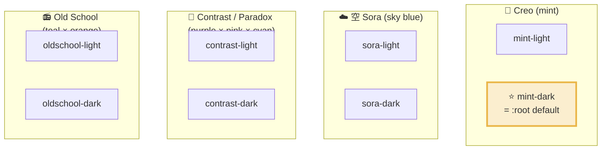

# Theme System — Creo UI Multi-Palette Matrix

**Status**: Shipped in `creo-ui-web@0.1.0` (2026-04-22)
**Scope**: `tokens/color/themes/**/*.json`、`transforms/config.{web,swift,rust}.js`、`transforms/color-utils.js`
**Related**: [editor-mode.md](./editor-mode.md)、creo-memories `mem_1CaHQrgWuQWSUSbZfV5uXm`

---

## 1. Overview

Creo UI は **4 color family × light/dark = 8 theme** を同梱する。



**`:root` default = Mint Dark** (Creo Design System の identity)。

---

## 2. 設計原則 (T-1 ~ T-10)

| # | 原則 | 決定内容 |
|---|------|---------|
| **T-1** | **Mint Dark is default** | Creo identity color = mint green。`:root` に mint-dark、consumer が明示しない限りこれが適用される |
| **T-2** | **family × variant の matrix** | 4 family (Creo / Sora / Contrast-Paradox / Old School) × light/dark 2 variant。family は flavor-centric に命名 (色単体でなく美意識軸) |
| **T-3** | **OKLCH is source of truth** | `$value` は `oklch(L C H [/ A])` 文字列で保持。hex に事前変換せず、build 時に platform ごとに変換 |
| **T-4** | **var 名は 0.0.x 互換** | `--color-brand-primary`, `--color-surface-bg-base`, `--color-text-primary` 等、旧 var 名を保持。themes segment は var 名から除去 |
| **T-5** | **`[data-theme="{id}"]` で切替** | 8 theme は全て `[data-theme]` attribute で選択可能。ancestor に指定すれば subtree 全体に適用 |
| **T-6** | **fleetstage 後方互換 alias** | `.dark` / `[data-theme="dark"]` → mint-dark、`[data-theme="light"]` → mint-light。fleetstage の `<html class="dark">` は変更なしで動作 |
| **T-7** | **system preference 逆転** | `:root` default が dark なので、`prefers-color-scheme: light` で `[data-theme]` 未指定時は mint-light に逆転 |
| **T-8** | **Swift/Rust は Mint Dark only (Phase 1)** | Phase 2 で `Color(dynamicProvider:)` / ratatui theme などで multi-theme 対応予定 |
| **T-9** | **editor-mode は theme 追従** | `tokens/editor-mode/*` の color は `var(--color-*)` literal で宣言、active theme に自動追従 |
| **T-10** | **新 theme 追加は DTCG JSON のみで完結** | 新 family を足したいときは `tokens/color/themes/{id}.json` を 1 ファイル追加するだけ。scripts/generate-themes.mjs で creo-memories preset からも再生成可能 |

---

## 3. 8 theme 一覧 (flavor 原文)

| id | name | family | flavor (公式 description) |
|----|------|--------|-------------------------|
| `mint-light` | Light Theme | Creo | *Default light theme with mint green accent* |
| **`mint-dark`** ⭐ | Dark Theme | Creo | *Dark theme with mint green accent — Creo Design System default* |
| `sora-light` | 空 (Sora) | 空 (Sora) | *Sky-inspired light theme with sky blue accent* |
| `sora-dark` | 空 - Dark (Sora Dark) | 空 (Sora) | *Night sky-inspired dark theme* |
| `contrast-light` | Contrast Light | Contrast / Paradox | *Vibrant light theme — the paradox in daylight、対立色が白の上で共存する矛盾* |
| `contrast-dark` | Contrast | Contrast / Paradox | *Vibrant dark theme — the paradox at nightfall、暗闇が矛盾を際立たせる* |
| `oldschool-light` | Old School | Old School | *Retro natural light theme with teal and orange accents* |
| `oldschool-dark` | Old School Dark | Old School | *Retro natural dark theme with teal and orange accents* |

### Family summary (美意識軸)

| family | public name | 核 | brand hue (OKLCH h) |
|--------|-------------|-----|-------------------|
| `creo` | **Creo** | 萌芽、創造の原色 | 160 (mint green) |
| `sora` | **空 (Sora)** | 空の開放、澄明 | 230 (sky blue) |
| `contrast` | **Contrast / Paradox** | 矛盾が同居する緊張 | 270 (purple) + 335 (pink) + 195 (cyan) |
| `oldschool` | **Old School** | 郷愁、ナチュラル | 145 (teal) + 55 (orange) |

4 つの美意識軸: **創造 / 空 / 矛盾 / 郷愁**。

---

## 4. なぜ OKLCH を source of truth にしたか (T-3)

### 選択の理由

1. **Perceptual uniformity**: OKLCH は知覚空間で L (明度) / C (彩度) / H (色相) が均等。hex では 2 色を混ぜたり調整したりする時に人間の感覚とズレる。**`l=0.85` → `l=0.75` = 均等に暗くなる**
2. **Gamut-aware**: modern browser が sRGB 範囲外の色 (P3、Rec.2020) を段階的にサポートしていく流れ。OKLCH 保持なら consumer device の color space に合わせて render される
3. **精度**: hex の 8-bit × 3 channel より OKLCH float の方が実質的精度が高い。複数 theme で hue を保持したまま明度だけ変える操作が無損失
4. **Modern CSS 標準**: `oklch(...)` は Baseline 2023 相当 (Safari 15.4+ / Chrome 111+ / Firefox 113+)。Creo ecosystem の consumer は modern browser 前提なので安全
5. **次世代 color space への橋頭堡**: Display P3、Rec.2020、HDR への対応も OKLCH を経由すれば最小コスト

### 副作用

- **Swift/Rust は OKLCH 文字列を parse できない** → build 時に hex/Rgb に変換 (`transforms/color-utils.js`)
- **8-bit hex output ではわずかに色が"丸まる"** → 人間の目では区別不能レベル、実用上問題なし
- **DTCG 標準の `color` type で OKLCH は valid** (spec § 8.3) だが、Style Dictionary の一部 transform は hex 前提。**custom format を hand-roll** することで回避

---

## 5. CSS 出力構造

`packages/web/dist/tokens.css` は 1 ファイルに以下を concat:

```css
/* 1) :root default = common + mint-dark */
:root {
  --editor-mode-axis-future: var(--color-brand-primary);
  --spacing-m: 16px;
  /* ... common tokens ... */

  --color-brand-primary: oklch(0.75 0.12 160);
  --color-surface-bg-base: oklch(0.15 0.02 260);
  /* ... mint-dark values (default) ... */
}

/* 2) 8 theme explicit selector */
[data-theme="mint-light"]      { /* mint-light values */ }
[data-theme="mint-dark"]       { /* mint-dark values (= :root と同値の alias) */ }
[data-theme="sora-light"]      { /* sora-light */ }
[data-theme="sora-dark"]       { /* sora-dark */ }
[data-theme="contrast-light"]  { /* Paradox light */ }
[data-theme="contrast-dark"]   { /* Paradox dark */ }
[data-theme="oldschool-light"] { /* Old School light */ }
[data-theme="oldschool-dark"]  { /* Old School dark */ }

/* 3) fleetstage 後方互換 alias */
.dark,
[data-theme="dark"] {
  /* = mint-dark */
}
[data-theme="light"] {
  /* = mint-light */
}

/* 4) prefers-color-scheme: light で default 逆転 */
@media (prefers-color-scheme: light) {
  :root:not(.light):not([data-theme="light"]):not([data-theme="mint-dark"]) {
    /* = mint-light (明示の dark 指定が無ければ light に逆転) */
  }
}
```

### Selector specificity の意図

- `:root` (0-0-0-1) < `[data-theme="..."]` (0-0-1-0) < `.class` (同等) < inline style (stronger)
- fleetstage が `<html class="dark">` で強制していた dark はそのまま通る (class-based override)
- consumer が `<body data-theme="sora-dark">` と書けば body 配下が sora-dark
- consumer が inline style で `--color-brand-primary: xxx` すると全てを上書き (user escape hatch)

---

## 6. Family naming: "Contrast → Paradox" の経緯

Contrast family (id=`contrast`) の公開名を "Contrast / Paradox" に格上げした経緯。

### きっかけ

当初 flavor を `"purple × pink × cyan"` の **色名** で表現していたが、二律背反・対立軸の **概念** に抽象化したい、というユーザー提案。

### 検討した候補

| 候補 | 日本語 | 評価 |
|------|--------|------|
| Yin-Yang | 陰陽 | 2 項対立で古典的、ただし 3 色構造と合わない |
| Mutual Conflict | 相克 | 力強いが重い |
| Antinomy | 二律 | 哲学的、直接的すぎ |
| **Paradox** | **逆説** | ⭐ **採用**。3 色が "矛盾しつつ共存" する状態を表現 |
| Two-sided | 表裏 | 静的 |
| Gap / Ma | 間 | 静的余白、Contrast の vibrancy とやや不整合 |

### Paradox 採用の根拠

1. **3 色構造と整合**: 陰陽 (2 項) では言い切れない「purple × pink × cyan が矛盾しつつ共存する状態」を直接表現
2. **vibe**: 静かな知的緊張 — 相克 (重い) / 間 (静的) の中間
3. **国際性**: 1 単語で英語/日本語 (逆説) 両方に通じる
4. **design 文脈**: Escher / Magritte / op-art / trompe-l'œil の系譜
5. **tech 文脈**: CAP theorem / Russell's paradox / Simpson's paradox — dev に familiar

### 4 family の美意識軸 (完成形)

**創造 (Creo) / 空 (Sora) / 矛盾 (Paradox) / 郷愁 (Old School)** が collection として 1 つの物語に。

---

## 7. Color utilities API (`transforms/color-utils.js`)

build tooling から呼べる pure JS ユーティリティ (external dep なし、50 cases の test あり)。

### OKLCH / Oklab / sRGB / hex

```js
parseOklch(str)                    // "oklch(0.85 0.14 160)" → { l, c, h, a? } or null
oklchToOklab({ l, c, h })          // OKLCH → Oklab
oklabToLinearSrgb({ L, a_, b_ })   // Oklab → [r, g, b] linear (0-1、範囲外あり)
linearToSrgb(x)                    // Linear sRGB → sRGB (gamma encode、0-1 clamp)
oklchToHex({ l, c, h, a? })        // OKLCH → "#rrggbb" or "#rrggbbaa"
oklchStringToHex(str)              // string → hex (parse + convert)
hexToRgb255(hex)                   // "#rrggbb" → [r, g, b] 0-255
hexToRgb01(hex)                    // "#rrggbb" → [r, g, b] 0-1 (Swift float 用)
```

### WCAG

```js
relativeLuminance([r, g, b])       // sRGB 0-255 → luminance 0-1 (WCAG 2.1 §1.4.3)
contrastRatio(colorA, colorB)      // 2 色の比 1-21
wcagLevel(ratio)                   // "AAA" (>=7) / "AA" (>=4.5) / "AAlarge" (>=3) / "fail"
oklchStringContrastRatio(a, b)     // 便利 wrapper
```

### Mixing (Phase 3 theme interpolation 向け)

```js
mixOklch(a, b, t)                  // OKLCH 空間で 2 色を補間 (hue は shortest path)
```

### 参考

- Björn Ottosson, "A perceptual color space for image processing" (2020): https://bottosson.github.io/posts/oklab/
- W3C WCAG 2.1 §1.4.3: https://www.w3.org/WAI/WCAG21/Understanding/contrast-minimum.html

---

## 8. Migration: 0.0.x → 0.1.0

### Breaking change summary

| 項目 | 0.0.4 まで | 0.1.0 以降 |
|------|----------|------------|
| `:root` default | light | **mint-dark** |
| Dark 切替 | `.dark`, `[data-theme="dark"]` | 同じ (alias として維持) |
| Light を明示したいとき | default (何もしない) | `[data-theme="light"]` or `[data-theme="mint-light"]` |
| var 名 (`--color-surface-bg-base` 等) | — | **変更なし**、完全互換 |
| system dark 検出 | `@media (prefers-color-scheme: dark)` で自動 | 今度は逆転、`@media (prefers-color-scheme: light)` で自動 light |

### Consumer タイプ別 migration

#### A) fleetstage (`<html class="dark">` 強制)
**変更不要**。`.dark` alias が mint-dark を指すので、画面は mint-dark で render される。operator 側の `:root` 上書き override は削除できる (残しても inline override として上書きされるだけで害なし)。

#### B) light-only consumer
0.0.4 まで何も指定せず light を得ていた場合、0.1.0 では dark になる。以下の片方を追加:
```html
<html data-theme="light">
```
または
```html
<html data-theme="mint-light">
```

#### C) system preference 追従
変更不要。`prefers-color-scheme` の挙動は逆転したが、`[data-theme]` 未指定時は system に従う (dark なら dark、light なら light)。

#### D) 他 theme を試したい
```html
<html data-theme="sora-dark">    <!-- 空 Dark -->
<html data-theme="contrast-dark"> <!-- Paradox Dark -->
<html data-theme="oldschool-light"> <!-- Old School -->
```

---

## 9. 新 theme の追加手順

### Option 1: creo-memories preset に追加 → generate-themes で取り込み

最も推奨。

1. `creo-memories/packages/creo-ui/src/palette/presets/{new-id}.ts` に TS preset を追加
2. `creo-memories/packages/creo-ui/src/palette/presets/index.ts` で export 追加
3. creo-ui 側 `scripts/generate-themes.mjs` の `themes` 配列にエントリー追加
4. `bun run gen:themes` → `tokens/color/themes/{new-id}.json` 生成
5. `bun run build` で全 platform 反映
6. web custom format は自動で `[data-theme="{new-id}"]` block を emit

### Option 2: creo-ui 側で独自 theme を追加

creo-memories 側を触らず、creo-ui 側だけで追加したい場合:

1. `tokens/color/themes/{new-id}.json` を手書き (path は `color.themes.{new-id}.brand.primary` 等、flat 構造で 0.0.x 互換)
2. `bun run build` で反映

既存 theme JSON の構造をコピーして OKLCH 値を変えるのが最速。

---

## 10. Roadmap

| Phase | 内容 | Status |
|-------|------|--------|
| 1 | 8 theme matrix + OKLCH source + Mint Dark default | ✅ **0.1.0 (2026-04-22) 完了** |
| 2a | `@creo/ui` (SolidJS) に `EditorHost` runtime 実装 + ThemeEditor 正式版 | 未着手 |
| 2b | Swift (`CreoUI`) で multi-theme (`Color(dynamicProvider:)` + NSAppearance) | 未着手 |
| 2c | Rust (`creo-ui` crate) で multi-theme 対応要否検討 (ratatui 等の theme 概念次第) | 未着手 |
| 3 | Figma sync (tokens.studio 連携) — GUI で OKLCH を編集してリポジトリに反映 | Planned |
| 4 | **Theme authoring pipeline** — ユーザーが独自 theme を登録できる runtime API (Editor Mode 経由で mix / 新規作成) | Planned |

---

## 11. 関連資料

- **Protocol spec**: [`editor-mode.md`](./editor-mode.md) (Editor Mode protocol D-1〜D-12)
- **Token spec**: [`tokens-spec.md`](../tokens-spec.md) (DTCG 適用ルール)
- **Walking skeleton**: [`../../examples/web-demo/`](../../examples/web-demo/) (Vite + SolidJS demo、8 theme 切替動作版)
- **creo-memories 最終像**: `mem_1CaHQrgWuQWSUSbZfV5uXm` (2026-04-22 決定、設計経緯含む)
- **Fleetstage Issue**: [chronista-club/creo-ui#1](https://github.com/chronista-club/creo-ui/issues/1) (0.1.0 で closed、移行手順 comment 付き)

## 12. Status log

- 2026-04-22: 0.1.0 publish、本 doc 初版
